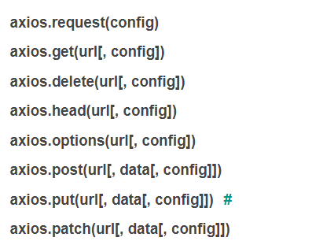

# Ajax

[Axios](Axios/Axios.md)

AJAX 是一种用于创建快速动态网页的技术。

通过在后台与服务器进行少量数据交换，AJAX 可以使网页实现异步更新。这意味着可以在不重新加载整个网页的情况下，对网页的某部分进行更新，**无刷新获取数据。**

传统的网页（不使用 AJAX）如果需要更新内容，必需重载整个网页面。

## XML

XML 设计用来传输和存储数据

XML没有预定义标签。HTML都是预定义标签

服务器返回给客户端的就是XML格式的字符串。前端接收到后，做解析，将数据提取出来做处理。


## JSON

AJAX的优点：页面无刷新与服务器进行通信，允许根据用户事件来更新页面部分内容

缺点：没有浏览历史，存在跨域问题，SEO不太友好


## HTTP协议（超文本传输协议）

规定了浏览器和万维网服务器之间通信的规则

### 状态码：

```ABAP
200   （成功）  服务器已成功处理了请求。 通常，这表示服务器提供了请求的网页。 
201   （已创建）  请求成功并且服务器创建了新的资源。 
202   （已接受）  服务器已接受请求，但尚未处理。 
203   （非授权信息）  服务器已成功处理了请求，但返回的信息可能来自另一来源。 
204   （无内容）  服务器成功处理了请求，但没有返回任何内容。 
205   （重置内容） 服务器成功处理了请求，但没有返回任何内容。
206   （部分内容）  服务器成功处理了部分 GET 请求。


300   （多种选择）  针对请求，服务器可执行多种操作。 服务器可根据请求者 (user agent) 选择一项操作，或提供操作列表供请求者选择。 
301   （永久移动）  请求的网页已永久移动到新位置。 服务器返回此响应（对 GET 或 HEAD 请求的响应）时，会自动将请求者转到新位置。
302   （临时移动）  服务器目前从不同位置的网页响应请求，但请求者应继续使用原有位置来进行以后的请求。
303   （查看其他位置） 请求者应当对不同的位置使用单独的 GET 请求来检索响应时，服务器返回此代码。
304   （未修改） 自从上次请求后，请求的网页未修改过。 服务器返回此响应时，不会返回网页内容。 
305   （使用代理） 请求者只能使用代理访问请求的网页。 如果服务器返回此响应，还表示请求者应使用代理。 
307   （临时重定向）  服务器目前从不同位置的网页响应请求，但请求者应继续使用原有位置来进行以后的请求。


400   （错误请求） 服务器不理解请求的语法。 
401   （未授权） 请求要求身份验证。 对于需要登录的网页，服务器可能返回此响应。 
403   （禁止） 服务器拒绝请求。
404   （未找到） 服务器找不到请求的网页。
405   （方法禁用） 禁用请求中指定的方法。 
406   （不接受） 无法使用请求的内容特性响应请求的网页。 
407   （需要代理授权） 此状态代码与 401（未授权）类似，但指定请求者应当授权使用代理。
408   （请求超时）  服务器等候请求时发生超时。 
409   （冲突）  服务器在完成请求时发生冲突。 服务器必须在响应中包含有关冲突的信息。 
410   （已删除）  如果请求的资源已永久删除，服务器就会返回此响应。 
411   （需要有效长度） 服务器不接受不含有效内容长度标头字段的请求。 
412   （未满足前提条件） 服务器未满足请求者在请求中设置的其中一个前提条件。 
413   （请求实体过大） 服务器无法处理请求，因为请求实体过大，超出服务器的处理能力。 
414   （请求的 URI 过长） 请求的 URI（通常为网址）过长，服务器无法处理。 
415   （不支持的媒体类型） 请求的格式不受请求页面的支持。 
416   （请求范围不符合要求） 如果页面无法提供请求的范围，则服务器会返回此状态代码。 
417   （未满足期望值） 服务器未满足"期望"请求标头字段的要求。


500   （服务器内部错误）  服务器遇到错误，无法完成请求。 
501   （尚未实施） 服务器不具备完成请求的功能。 例如，服务器无法识别请求方法时可能会返回此代码。 
502   （错误网关） 服务器作为网关或代理，从上游服务器收到无效响应。 
503   （服务不可用） 服务器目前无法使用（由于超载或停机维护）。 通常，这只是暂时状态。 
504   （网关超时）  服务器作为网关或代理，但是没有及时从上游服务器收到请求。 
505   （HTTP 版本不受支持） 服务器不支持请求中所用的 HTTP 协议版本。


```


## AJAX四步骤：

```javascript
const btn = document.querySelect('btn')
btn.addEventListener('click',function(){
  //创建对象
  const xhr = new XMLHttpRequest();
  //初始化 发送请求的类型 url
  xhr.open('Get','https://xxxxxxxxx')
  //发送
  xhr.send();
  //事件绑定 处理响应结果
  xhr.onreadystatechange = function(){
  //on 当....的时候 
  //readystate 是xhr对象中的属性，表示状态 
  //判断1
    if(xhr.readystate===4){
      //判断2：响应码的要求
      if(xhr.status>=200 && xhr<=300){
      //成功之后的操作
      }else{
      //失败后的操作
      }
    }
  }
})
```


1. 创建对象
	1. `**const xhr = new XMLHttpRequest();**`
2. 初始化
	1. **`xhr.open('Get','https://xxxxxxxxx')`**
3. 发送
	1. `**xhr.send();**`
4. 事件绑定，处理响应结果
	`**xhr.onreadystatechange = function(){...}**`
		on 当什么的时候
		readystate是xhr对象中的属性，表示状态
			0：未初始化
			1：open（）方法调用完毕
			2：send（）方法调用完毕
			3：服务端返回了部分结果
			4：服务端返回了全部的结果
		change：状态改变的时候触发（会触发四次）
		判断1：当xhr.eadystate===4的时候返回了所有的结果
		判断2：响应状态码200≤xhr.status≤300
		
5. 处理结果：
	行
	头
	空行
	体 response


## 设置参数：

`**xhr.open('Get','https://xxxxxxxxx:8080/server**``**?a=100$b=200$c=300**``**')**`

## 发送post请求

1. 服务端配置post请求
2. 客户端的**初始化**中，设置为发送post请求
	**`xhr.open('POST', 'http：//xxxxxx');`**
3. post请求**发送参数**，在send()方法中：
	**`xhr.send('a=100&b=200&c=300');`**
4. post设置**请求头**，在open（）方法和send（）方法之间：
	//设置请求头
	**`xhr.setRequestHeader('Content-Type','application/x-www-form-urlencoded');`**
	**`xhr.setRequestHeader('name','atguigu') `****//**自定义请求
	//3. 发送
	**`xhr.send('a=100&b=200&c=300');`**


## 服务端响应JSON数据

1. 服务端：
	```javascript
	app.all('/json-server', (request, response) => {
	    //设置响应头  设置允许跨域
	      response.setHeader('Access-Control-Allow-Origin', '*');
	    //响应头
	    response.setHeader('Access-Control-Allow-Headers', '*');
	    //响应一个数据
	    const data = {
	        name: 'atguigu'
	    };
	    //对对象进行字符串转换。send不能接收一个对象，只能接收字符串或者buffer
	    let str = **JSON.stringify(data)**;
	    //设置响应体
	    response.send(str);
	});
	```
	
	**JSON.stringify()**
		**返回与指定值对应的JSON字符串**，可以通过额外的参数, 控制仅包含某些属性, 或者以自定义方法来替换某些key对应的属性值。
	**JSON.parse()**
		**解析JSON字符串并返回对应的值**，可以额外传入一个转换函数，用来将生成的值和其属性, 在返回之前进行某些修改。
2. 客户端接收JSON数据之后的转换：
1. 手动对数据进行转换：
	`**let data = JSON.parse(xhr.response);**`
	**`console.log(data);`**
2. 自动转换
	//设置响应体数据的类型（发送请求之后）
	`**xhr.responseType = 'json';**`
	// 自动转换（事件绑定之中）
	`**console.log(xhr.response);**`
	**`result.innerHTML = xhr.response.name;`**


## IE缓存问题的解决：

IE浏览器会对AJAX请求结果作为一个缓存，当下一次发送请求时，它走的是本地缓存，并不是服务器返回的最新数据对于时效性比较强的场景，AJAX缓存会影响这个结果不够正常的去显示。

解决方法：

**`xhr.open("GET",'http://127.0.0.1:8000/ie`****`?t='+Date.now()`****`);`**

加上一个时间戳，使每次的请求都是不同的url。表示两次请求都不相同

状态码302


## 请求超时和网络异常

xhr的属性：**` xhr.timeout`**，**`xhr.ontimeout`**，**`xhr.onerror`**

```javascript
const xhr = new XMLHttpRequest();
//超时设置 2s 设置
xhr.timeout = 2000;
//超时回调
xhr.ontimeout = function(){
  alert("网络异常, 请稍后重试!!");
}
//网络异常回调
xhr.onerror = function(){
  alert("你的网络似乎出了一些问题!");
}
xhr.open("GET",'http://127.0.0.1:8000/delay');
```


## 取消请求

在请求的过程之中，在结果还没回来之前，手动取消请求（超时自动取消请求）

abot()方法：取消请求

```javascript
const btns = document.querySelectorAll('button');
let x = null;//声明为全局变量

btns[0].onclick = function(){
    x = new XMLHttpRequest();
    x.open("GET",'http://127.0.0.1:8000/delay');
    x.send();
}

// abort
btns[1].onclick = function(){
    **x.abort();**
}
```


x变量是全局变量，才能在不同的函数内部进行操作。


## 重复发送请求问题

服务器接收到太多的相同的请求。（用户频繁发送请求）

解决方案：

点击第二次的时候发送一个新的请求，取消第一次请求：

1. 添加一个标识变量，表示是否正在发送Ajax请求：
	**`let isSending = false;`**
2. 在创建好XMLHttpRequest之后（创建好请求之后）将标识变量的值变成true：表示正在发送请求
3. 在收到响应之后（请求完成之后）即readystate===4的时候（不需要状态码为200，因为有可能是一个失败的请求），再将标识变量变成false，表示当前没有发送请求
	触发时间的时候，判断标识符的值，如果标识符为true，则表示正在发送请求，则取消发送当前请求，创建发送一个新的请求

```javascript
let x=null
let isSending = false; // 是否正在发送AJAX请求

btns[0].onclick = function(){
    //判断标识变量
    if(isSending) x.abort();// 如果正在发送, 则取消该请求, 创建一个新的请求
    x = new XMLHttpRequest();
    //修改 标识变量的值
    isSending = true;
    x.open("GET",'http://127.0.0.1:8000/delay');
    x.send();
    x.onreadystatechange = function(){
        if(x.readyState === 4){
            //修改标识变量
            isSending = false;
        }
    }
}
```


## Axios中发送Ajax请求：

默认情况下发送get请求



data是响应体的内容（服务器返回的结果）

request就是AJAX发送的请求的实例对象。（new XMLHttpRequest）

```javascript
axios.defaults.baseURL = 'http://127.0.0.1:8000';
//发送get请求
btns[0].onclick = function () {
    //GET 请求
    axios.get('/axios-server', {
        //url 参数
        params: {
            id: 100,
            vip: 7
        },
        //请求头信息
        headers: {
            name: 'atguigu',
            age: 20
        }
    }).then(value => {
        console.log(value);
    });
}
//发送post请求
btns[1].onclick = function () {
    axios.post('/axios-server', {
        username: 'admin',
        password: 'admin'
    }, {
        //url 
        params: {
            id: 200,
            vip: 9
        },
        //请求头参数
        headers: {
            height: 180,
            weight: 180,
        }
    });
}
//通用方法发送请求，非常贴合协议
btns[2].onclick = function(){
    axios({
        //请求方法
        method : 'POST',
        //url
        url: '/axios-server',
        //url参数
        params: {
            vip:10,
            level:30
        },
        //头信息
        headers: {
            a:100,
            b:200
        },
        //请求体参数
        data: {
            username: 'admin',
            password: 'admin'
        }
    }).then(response=>{
        //响应状态码
        console.log(response.status);
        //响应状态字符串
        console.log(response.statusText);
        //响应头信息
        console.log(response.headers);
        //响应体
        console.log(response.data);
    })
}
```


## 同源策略

### JSONP

**script src请求的应该是一段js的代码，前端的浏览器引擎解析并渲染。**

1. 前后端约定好一个函数（例如handle(data) ）
2. 前端写好该回调函数
	```javascript
	//声明 handle 函数
	function handle(data){
	    input.style.border = "solid 1px #f00";
	    //修改 p 标签的提示文本
	    p.innerHTML = data.msg;
	}
	```
	
3. 在服务端写好需要使用的数据，并传过来的时候调用约定好的回调函数。
	```javascript
	app.all('/jsonp-server',(request, response) => {
	    // response.send('console.log("hello jsonp")');
	    const data = {
	        name: '尚硅谷atguigu'
	    };
	    //将数据转化为字符串
	    let str = JSON.stringify(data);
	    //调用回调函数返回结果
	    response.end(`**handle(${str})**`);
	});
	```
	
4. 发送请求之后，浏览器通过解析 服务端传过来的调用函数的代码 （必须是js代码）然后并渲染。
原生的jsonp

```javascript
//声明 handle 函数
function handle(data){
    input.style.border = "solid 1px #f00";
    //修改 p 标签的提示文本
    p.innerHTML = data.msg;
}

//绑定事件
input.onblur = function(){
    //获取用户的输入值
    let username = this.value;
    **//向服务器端发送请求 检测用户名是否存在
    //1. 创建 script 标签
    const script = document.createElement('script');
    //2. 设置标签的 src 属性
    script.src = 'http://127.0.0.1:8000/check-username';
    //3. 将 script 插入到文档中
    document.body.appendChild(script);**
}
```


### CORS跨域资源共享

