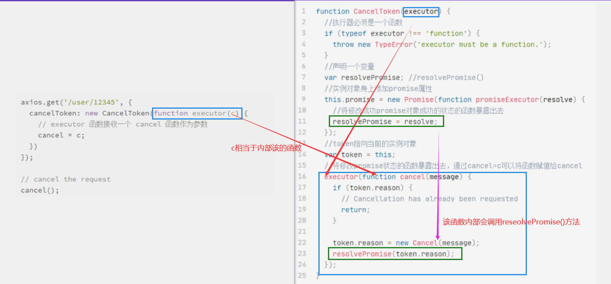

# config配置对象

1. `url：`'请求地址'
2. `method：`'请求类型'（get/post）
3. `baseURL：`'基础url，会将baseURL和url做一个结合'
4. `transformRequest` 允许在向服务器发送前，修改请求数据  

 > 只能用在 'PUT', 'POST' 和 'PATCH' 这几个请求方法  
 > 后面数组中的函数必须返回一个字符串，或 ArrayBuffer，或 Stream
  
  ```
 transformRequest: [function (data, headers) {  
  // 对 data 进行任意转换处理  
  return data;  
 }],
  ```  
  
5. `transformResponse` 在传递给 then/catch 前，允许修改响应数据  

  ```
    transformResponse: [function (data) {  
      // 对 data 进行任意转换处理  
      return data;  
    }],
  ```

6. `headers：`{'头信息'}
7. `params：`{参数:参数值}
8. .....很多配置信息，看官网：
[http://axios-js.com/zh-cn/docs/index.html#请求配置](http://axios-js.com/zh-cn/docs/index.html#请求配置)

# 全局默认值

在全局中使用

```javascript
axios.defaults.baseURL = 'https://api.example.com';
axios.defaults.headers.common['Authorization'] = AUTH_TOKEN;
axios.defaults.headers.post['Content-Type'] = 'application/x-www-form-urlencoded';
```

# 自定义实例默认值

```javascript
// 创建实例对象
const instance = axios.create({
  baseURL: 'https://api.example.com';
  tiameout: 5000
});
//方法一：调用
instance({
  url:'/xxxx',
  method:'GET'
}).then((response)=>{
    console.log(response)
  })
 //方法二:也可以直接使用get
 instance.get({
   url:'/xxxxx'
 }).then((response)=>{
   console.log(response.data)
 })
 
 //这种方式可以用于配置需要给不同的服务器发送请求的时候，简化操作。需要给谁发就调哪个对象。

```

**响应体**reponse.data之中包含：

`code:`状态码

`message:`状态信息(出错的时候 该message就是错误信息)

`result:`

`_proto_:`原型

# 拦截器（函数）

## 请求拦截器

在发送请求之前，对发送的参数进行检查或者其它的操作

```javascript
// 添加请求拦截器
axios.interceptors.request.use(function (config) {
    // 在发送请求之前做些什么
    return config;
  }, function (error) {
    // 对请求错误做些什么
    return Promise.reject(error);
  });

```

## 响应拦截器

当服务器返回结果的时候，在我们处理结果之前先对结果进行预处理

```javascript
// 添加响应拦截器
axios.interceptors.response.use(function (response) {
    // 对响应数据做点什么
    return response;
  }, function (error) {
    // 对响应错误做点什么
    return Promise.reject(error);
  });
```

> 当有多个拦截器的时候(洋葱模型)
  >请求从外边到里面（最后设置的在最外面），响应是从里面到外面
  >请求拦截器是进入堆栈（先进后出）unshift
  响应拦截器是进入队列（先进先出）push

# axios取消请求

axios的配置项cancelTocken用于取消请求中：

```javascript
  // `cancelToken` 指定用于取消请求的 cancel token
  // （查看后面的 Cancellation 这节了解更多）
  cancelToken: new CancelToken(function (cancel) {
  })
```

## 取消请求

回调+闭包（订阅发布）

```javascript
const CancelToken = axios.CancelToken;
let cancel;

axios.get('/user/12345', {
  cancelToken: new CancelToken(function executor(c) {
    // executor 函数接收一个 cancel 函数作为参数
    cancel = c; //
  })
});

// cancel the request
cancel();
```

所以在`axios`中，我们也会根据配置中是否包含`cancelToken`来取消发送（源码）：

```javascript
function axios(url,config){
  return new Promise((resolve,reject)=>{
    const xhr = new XMLHttpRequest();
    ...
    if(config.cancelToken){
      // 如果存在 cancelToken 参数
      // xhr.abort() 终止发送任务
      // reject() 走reject方法
    }
    ...
    
function CancelToken(executor){
  let cancel = ()=>{};
  executor(cancel)
}
```

- `executor`
 这是一个双参函数，参数为`resolve和reject`。`Promise`的实现会立即执行`executor`，并传入`resolve`和`reject`函数（`Promise`构造器将会在返回新对象之前`executor`）。当`resolve`和`reject`函数被调用时，它们分别对promise执行`resolve`和`reject`。`executor`通常会触发一些异步运算，一旦运算成功完成，则`resolve`掉这个promise，如果出错则`reject`掉。如果`executor`函数执行时抛出异常，promise状态会变为`rejected`。`executor`的返回值也会被忽略。

## 取消请求代码解析

```javascript
function CancelToken(executor) {
  //执行器必须是一个函数
  if (typeof executor !== 'function') {
    throw new TypeError('executor must be a function.');
  }
  //声明一个变量
  var resolvePromise; //resolvePromise()
  //实例对象身上添加promise属性
  this.promise = new Promise(function promiseExecutor(resolve) {
    //将修改成功promise对象成功的状态的函数暴露出去
    resolvePromise = resolve;
  });
  //token指向当前的实例对象
  var token = this;
  //将修改promise状态的函数暴露出去，通过cancel=c可以将函数赋值给cancel
  executor(function cancel(message) {
    if (token.reason) {
      // Cancellation has already been requested
      return;
    }

    token.reason = new Cancel(message);
    resolvePromise(token.reason);
  });
}

```



**cancel()函数运行→c()函数运行→resolvePromise()函数运行→resolve()函数运行→this.promise的状态发生改变→执行成功的回调也就是执行abort()函数（取消请求）。**

## 取消请求（用户频繁请求）

利用cancel的值判断是否处于请求之中。

如果正在请求，就取消请求。

如果没有请求，就请求，在请求完成之后同时将cancel的值初始化为null

```javascript

cancel=null
**if(cancel!==null){
//取消上一次的请求
  cancel()
}**
axios({
  method:'GET'
  url:''
  cancelTocken:new axios.CancelTocken(function(c){
    cancel=c
  })
  
}).then((response)=>{
  //将cancel的值初始话
  cancel=null
})
```
