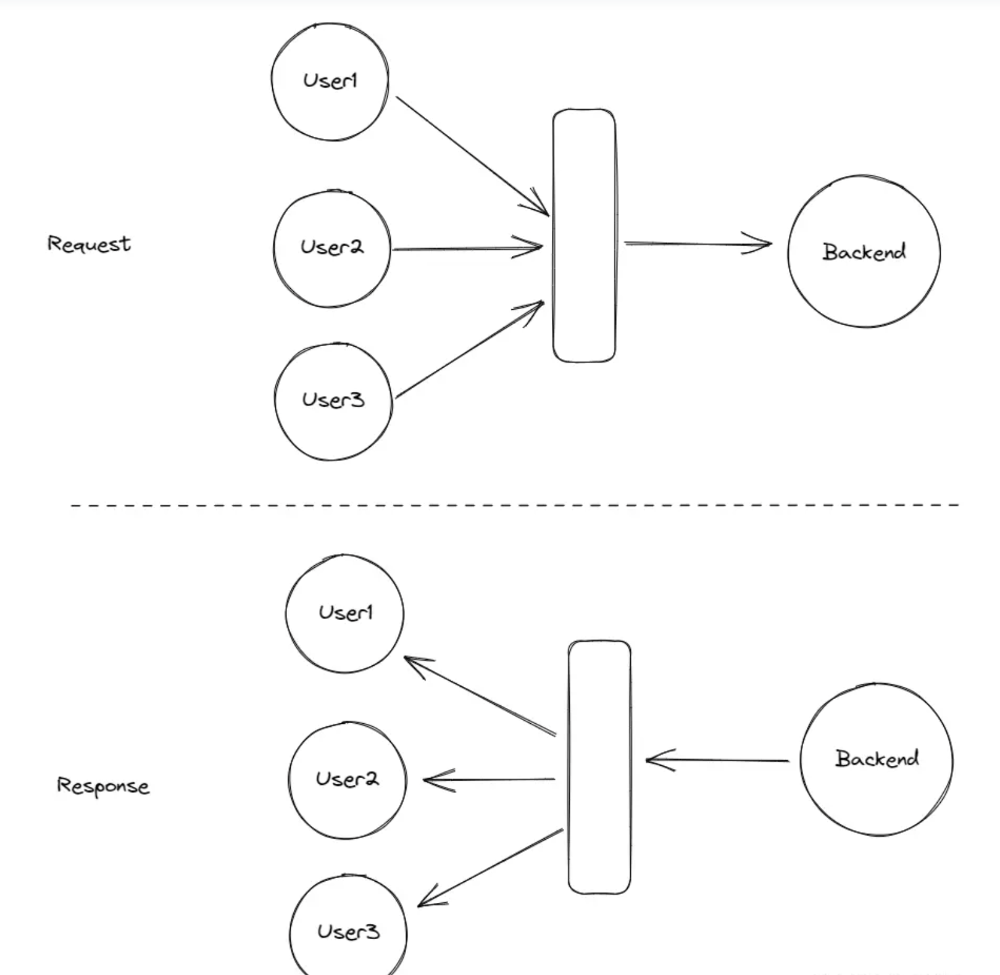

#

## 自动合并的网络请求（闭包）

**场景：** 一个列表中批量获取用户的信息，一次渲染几十个用户组件，需要同时向后端发送n个网络请求
> 场景补充：
>
> 1. 组件意外触发了多次useEffect，会导致参数被多次重复收集，或许还需要一个去重的手段
> 2. http2的流式传输？
> 3. 每一个人员头像， 都需要调接口用身份证获取头像照片连接。而这个头像（组件）也是在列表和任意地方都有机会用到。

**代码场景：**
  不在用户的上层去获取信息，然后分发给子组件。
  `<Item />` 组件内部根据传入的id自行获取对应的数据，然后自我处理。

```ts
const List = () => {
 return itemInfoList.map((info) => <Item info={info} />)
}
```

**解决思路：**

1. 完整代码

```ts
interface QueueItem<T, R> {
  params: T;
  resolve: (r: R) => void;
  reject: (reason: unknown) => void;
}

/**
 * 创建一个自动合并请求的函数
 * 在一定窗口期内的所有请求都会被合并提交合并发送
 * @param fn 合并后的请求函数
 * @param windowMs 窗口期
 */
export function createAutoMergedRequest<T, R>(
  fn: (mergedParams: T[]) => Promise<R[]>,
  windowMs = 200
): (params: T) => Promise<R> {
  let queue: QueueItem<T, R>[] = [];
  let timer: number | null = null;

  async function submitQueue() {
    timer = null; // 清空计时器以接受后续请求
    const _queue = [...queue];
    queue = []; // 清空队列

    try {
      const list = await fn(_queue.map((q) => q.params));
      _queue.forEach((q1, i) => {
        q1.resolve(list[i]);
      });
    } catch (err) {
      _queue.forEach((q2) => {
        q2.reject(err);
      });
    }
  }

  return (params: T): Promise<R> => {
    if (!timer) {
      // 如果没有开始窗口期，则创建
      timer = window.setTimeout(() => {
        submitQueue();
      }, windowMs);
    }

    return new Promise<R>((resolve, reject) => {
      queue.push({
        params,
        resolve,
        reject,
      });
    });
  };
}

```

---

2. 代码解析
   `createAutoMergedRequest`函数返回一个匿名函数`(fn: (mergedParams: T[]) => Promise<R[]>)`，来接受参数并返回结果请求`Promise<R[]>`
   泛型 T 和 R:
   `createAutoMergedRequest` 接受的 `fn` 参数的类型是`(mergedParams: T[]) => Promise<R[]>` ，而返回的函数定义是 `(params: T): Promise<R>`。这是因为他会自动把请求的结果拆分成独立的返回值返回到对应的调用处。

---

3. 返回的函数体:

```ts
  if (!timer) {
  // 如果没有开始窗口期，则创建
  timer = window.setTimeout(() => {  //首先判断闭包中是否存在定时器 timer, 如果没有则创建一个timer
    submitQueue();
  }, windowMs);//windowMs 后执行 submitQueue 方法

  }

  return new Promise<R>((resolve, reject) => { // 创建返回一个promise，把参数和promise相关的下一步操作都推到 queue 
  queue.push({
    params,
    resolve,
    reject,
  });
  });

  // 在这个窗口期内调用该函数的请求都会被收集起来
  // 等到若干次调用后，定时器到时间了，唤起回调执行submitQueue 方法，我们来看看 submitQueue 的操作。

```

```ts
async function submitQueue() {

  // 清理 timer, 清理 queue 并把队列里的项单独存放起来，防止影响到下一次执行
  timer = null; 
  const _queue = [...queue]; 
  queue = []; // 清空队列

  // 通过 fn(_queue.map((q) => q.params)) 来把队列中的参数拿出来，传给 fn 调用
  // 此时的 fn 就会接收到一个数组。并确保返回的结果也是一个同等大小且一一对应的数据即可
  const ret = fn(_queue.map((q) => q.params));  

  // 如果请求无误，我们就循环队列，把结果通过队列中记录的 resolve 把结果返回给我们之前创建的promise。
  try {
    const list = await fn(_queue.map((q) => q.params));
    _queue.forEach((q1, i) => {
      q1.resolve(list[i]);
    });
  } catch (err) {
    _queue.forEach((q2) => {
      q2.reject(err);
    });
  }
}

```

这样我们就实现了一个工具函数，我们可以在一个窗口期内收集到多个网络请求，并把他们汇聚成一个请求发送到后端。后端结果返回回来后，我们再把请求结果拆分分发给独立的调用方。

```ts

fetchUserInfo(1)
fetchUserInfo(2)
fetchUserInfo(3)
```



> **forEach和map的区别**
 **forEach**
  遍历数组中的元素。
  为每个元素执行回调。
  无返回值。
 **map**
  遍历数组中的元素
> 通过对每个元素调用函数，将每个元素“映射（map）”到一个新元素，从而创建一个新数组。
