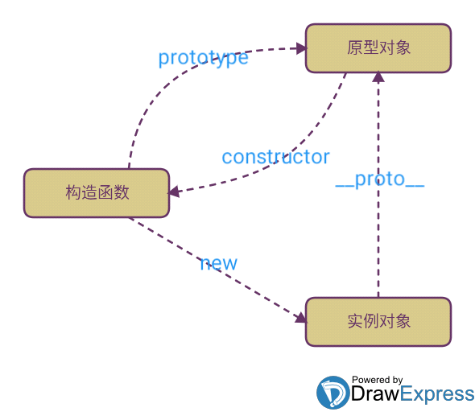
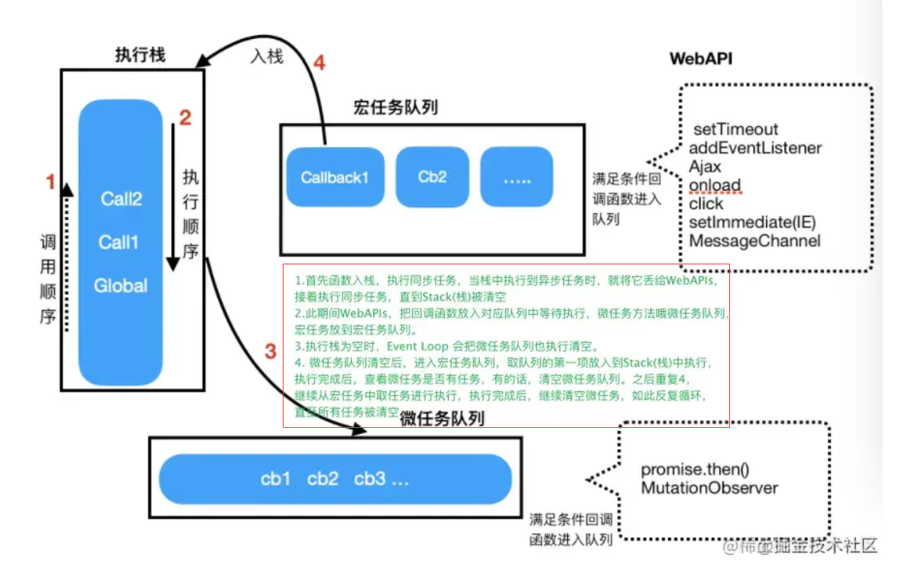
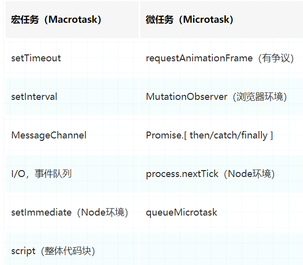

# JS

## this

### call()和apply()的区别

- 它们的作用一模一样，区别仅在于传入参数的形式的不同。
 apply 接受两个参数，第一个参数指定了函数体内 this 对象的指向，第二个参数为一个带下标的集合，这个集合可以为数组，也可以为类数组，apply 方法把这个集合中的元素作为参数传递给被调用的函数。
 call 传入的参数数量不固定，跟 apply 相同的是，第一个参数也是代表函数体内的 this 指向，从第二个参数开始往后，每个参数被依次传入函数。
  - `this`对象是是执行上下文中的一个属性，它指向最后一次调用这个方法的对象，在全局函数中，`this`等于`window`，而当函数被作为某个对象调用时，this等于那个对象。 在实际开发中，`this` 的指向可以通过四种调用模式来判断。
  1. **函数调用**，当一个函数不是一个对象的属性时，直接作为函数来调用时，`this`指向全局对象。
  2. **方法调用**，如果一个函数作为一个对象的方法来调用时，`this`指向这个对象。
  3. **构造函数调用**，`this`指向这个用`new`新创建的对象。
  4. **第四种是 ****`apply 、 call 和 bind`**** 调用模式**，这三个方法都可以显示的指定调用函数的 this 指向。其中 apply 方法接收两个参数：一个是 this 绑定的对象，一个是参数数组。call 方法接收的参数，第一个是 this 绑定的对象，后面的其余参数是传入函数执行的参数。也就是说，在使用 call() 方法时，传递给函数的参数必须逐个列举出来。bind 方法通过传入一个对象，返回一个 this 绑定了传入对象的新函数。这个函数的 this 指向除了使用 new 时会被改变，其他情况下都不会改变。

### 实现call，apply，bind函数

- **（1）call 函数的实现步骤：**
- 判断调用对象是否为函数，即使是定义在函数的原型上的，但是可能出现使用 call 等方式调用的情况。
- 判断传入上下文对象是否存在，如果不存在，则设置为 window 。
- 处理传入的参数，截取第一个参数后的所有参数。
- 将函数作为上下文对象的一个属性。
- 使用上下文对象来调用这个方法，并保存返回结果。
- 删除刚才新增的属性。
- 返回结果。

 ```javascript
 Function.prototype.myCall = function(context) {
 // 判断调用对象
 if (typeof this !== "function") {
   console.error("type error");
 }
 // 获取参数
 let args = [...arguments].slice(1),
   result = null;
 // 判断 context 是否传入，如果未传入则设置为 window
 context = context || window;
 // 将调用函数设为对象的方法
 context.fn = this;
 // 调用函数
 result = context.fn(...args);
 // 将属性删除
 delete context.fn;
 return result;
 };
 
 ```

- **（2）apply 函数的实现步骤：**
- 判断调用对象是否为函数，即使是定义在函数的原型上的，但是可能出现使用 call 等方式调用的情况。
- 判断传入上下文对象是否存在，如果不存在，则设置为 window 。
- 将函数作为上下文对象的一个属性。
- 判断参数值是否传入
- 使用上下文对象来调用这个方法，并保存返回结果。
- 删除刚才新增的属性
- 返回结果

 ```javascript
 Function.prototype.myApply = function(context) {
 // 判断调用对象是否为函数
 if (typeof this !== "function") {
   throw new TypeError("Error");
 }
 let result = null;
 // 判断 context 是否存在，如果未传入则为 window
 context = context || window;
 // 将函数设为对象的方法
 context.fn = this;
 // 调用方法
 if (arguments[1]) {
   result = context.fn(...arguments[1]);
 } else {
   result = context.fn();
 }
 // 将属性删除
 delete context.fn;
 return result;
 
 };
 
 ```

- **（3）bind 函数的实现步骤：**
- 判断调用对象是否为函数，即使是定义在函数的原型上的，但是可能出现使用 call 等方式调用的情况。
- 保存当前函数的引用，获取其余传入参数值。
- 创建一个函数返回
- 函数内部使用 apply 来绑定函数调用，需要判断函数作为构造函数的情况，这个时候需要传入当前函数的 this 给 apply 调用，其余情况都传入指定的上下文对象。

 ```javascript
 Function.prototype.myBind = function(context) {
 // 判断调用对象是否为函数
 if (typeof this !== "function") {
   throw new TypeError("Error");
 }
 // 获取参数
 var args = [...arguments].slice(1),
   fn = this;
 return function Fn() {
   // 根据调用方式，传入不同绑定值
   return fn.apply(
     this instanceof Fn ? this : context,
     args.concat(...arguments)
   );
 };
 };
 
 ```

## js数据类型、typeof、instanceof、类型转换

1. **`string、number、boolean、null、undefined、object(function、array)、symbol(ES10 BigInt)`**
2. `typeof` 主要用来判断数据类型 返回值有`string、boolean、number、function、object、undefined。`

 ```javascript
 typeof null  // 'object'
 typeof undefined  // 'undefined'
 ```

 ```javascript
 null == undefined  // true
 null === undefined  // false
 !!null === !!undefined  // true
 ```

3. `instanceof` 判断该对象是谁的实例。
4. `null`表示空对象 `undefined`表示已在作用域中声明但未赋值的变量
5. **`null`****转化为 ****`number`**** 时，会转换成****`0`**
 `undefined` 转换为 `number` 时，会转换为 `NaN`
 存在指针，找不到东西 null。 不存在指针undefined
6. **也可以使用**`**Object.prototype.toString.call([])**`**判断数据类型**

### typeof

```javascript
console.log(typeof 1);               // number
console.log(typeof true);            // boolean
console.log(typeof 'mc');            // string
console.log(typeof Symbol)           // function
console.log(typeof function(){});    // function
console.log(typeof console.log());   // function
console.log(typeof []);              // object 
console.log(typeof {});              // object
console.log(typeof null);            // object
console.log(typeof undefined);       // undefined


优点：能够快速区分基本数据类型
缺点：不能将Object、Array和Null区分，都返回object

```

### instanceof实现原理

leftVaule instanceof rightVaule（通过比较他们之间的原型对象）即实例对象上面的_proto_指向的原型对象和构造函数prototype属性的原型对象指向的是一个值。

```javascript
nceof
console.log(1 instanceof Number);                    // false
console.log(true instanceof Boolean);                // false 
console.log('str' instanceof String);                // false  
console.log([] instanceof Array);                    // true
console.log(function(){} instanceof Function);       // true
console.log({} instanceof Object);                   // true

优点：能够区分Array、Object和Function，适合用于判断自定义的类实例对象
缺点：Number，Boolean，String基本数据类型不能判断

```

```javascript
function myInstanceof(left, right) {
    let proto = Object.getPrototypeOf(left);//proto是left的原型对象
    while(true) {
        if(proto == null) return false; //直到找到null的时候返回false，循环结束
        if(proto == right.prototype) return true;
        proto = Object.getPrototypeof(proto);
    }
}
console.log(myInstanceof('hello',String)); 

```



### Object.prototype.toString.call()

```javascript
var toString = Object.prototype.toString;

console.log(toString.call(1));                      //[object Number]
console.log(toString.call(true));                   //[object Boolean]
console.log(toString.call('mc'));                   //[object String]
console.log(toString.call([]));                     //[object Array]
console.log(toString.call({}));                     //[object Object]
console.log(toString.call(function(){}));           //[object Function]
console.log(toString.call(undefined));              //[object Undefined]
console.log(toString.call(null));                   //[object Null]

```

## var && let && const

- var定义的变量，`没有块的概念，可以跨块访问`, 不能跨函数访问。  
 let定义的变量，只能在块作用域里访问，不能跨块访问，也不能跨函数访问。  
 const用来定义常量，使用时必须初始化(即必须赋值)，只能在块作用域里访问，且不能修改。
- var可以`先使用，后声明`，因为存在变量提升；let必须先声明后使用。
- var是允许在相同作用域内`重复声明同一个变量`的，而let与const不允许这一现象。
- 在全局上下文中，基于let声明的全局变量和全局对象GO（window）没有任何关系 ;  
 var声明的变量会和GO有映射关系；
- let /const/function会把当前所在的大括号(除函数之外)作为一个全新的块级上下文，应用这个机制，在开发项目的时候，遇到循环事件绑定等类似的需求，无需再自己构建闭包来存储，只要基于let的块作用特征即可解决

### 暂时性死区

ES6 中有明确的规定：如果区块中存在 let 和 const 命令，这个区块对这些命令声明的变量，从一开始就形成了封闭作用域。假如我们尝试在声明前去使用这类变量，就会报错。

这一段会报错的危险区域，有一个专属的名字，叫”暂时性死区“。在我们的 demo 中，以红线为界，上面的区域就是暂时性死区：

```javascript
var me = 'icon';

{
  me = 'lee';
  ---------------------------上面就是暂时性死区（会报错）
  let me;
}
```

因为let并不会有声明提升，所以上面的内容{}会报错。

## 作用域和作用域链

## 闭包

闭包是指有权访问另一个函数作用域中的变量的函数 ——《javascript高级程序设计》

在js中变量的作用域属于函数作用域, 在函数执行完后,作用域就会被清理,内存也会随之被回收,但是由于闭包函数是建立在函数内部的子函数, 由于其可访问上级作用域,即使上级函数执行完, 作用域也不会随之销毁, 这时的子函数(也就是闭包),便拥有了访问上级作用域中变量的权限,即使上级函数执行完后作用域内的值也不会被销毁

**闭包中的变量存储的位置是堆内存。**

- 闭包用途：

 1. 能够访问函数定义时所在的词法作用域(阻止其被回收)
 2. 私有化变量
 3. 模拟块级作用域
 4. 创建模块

- 闭包缺点：会导致函数的变量一直保存在内存中，过多的闭包可能会导致内存泄漏

**闭包应用场景**

闭包的两个场景，闭包的两大作用：`保存/保护`。 在开发中, 其实我们随处可见闭包的身影, 大部分前端javascript 代码都是“事件驱动”的,即一个事件绑定的回调方法; 发送ajax请求成功|失败的回调;setTimeout的延时回调;或者一个函数内部返回另一个匿名函数,这些都是闭包的应用。

## 原型/原型链

### **原型:**

对象中固有的__proto__属性，该属性指向对象的prototype原型属性。

### **原型链:**

 当我们访问一个对象的属性时，如果这个对象内部不存在这个属性，那么它就会去它的原型对象里找这个属性，这个原型对象又会有自己的原型，于是就这样一直找下去，也就是原型链的概念。原型链的尽头一般来说都是**Object.prototype**所以这就是我们新建的对象为什么能够使用toString()等方法的原因。

### **特点:**

javascript对象是通过引用来传递的，我们创建的每个新对象实体中并没有一份属于自己的原型副本。当我们修改原型时，与之相关的对象也会继承这一改变。
this指向、new关键字

## new关键字

1. 首先创建了一个**新的空对象**
2. **设置原型**，将对象的原型设置为函数的`prototype`对象。
3. **让函数的****`this`****指向这个对象**，执行构造函数的代码（为这个新对象添加属性）
4. 判断函数的返回值类型，如果是值类型，返回创建的对象。如果是引用类型，就返回这个引用类型的对象。

## 执行上下文

执行上下文就是当前 javascript 代码被解析和执行时所在环境的抽象概念， javascript 中运行任何的代码都是在执行上下文中运行

- 全局执行上下文： 这是默认的、最基础的执行上下文。不在任何函数中的代码都位于全局执行上下文中。它做了两件事：1. 创建一个全局对象，在浏览器中这个全局对象就是 window 对象。2. 将 this 指针指向这个全局对象。一个程序中只能存在一个全局执行上下文。
- 函数执行上下文： 每次调用函数时，都会为该函数创建一个新的执行上下文。每个函数都拥有自己的执行上下文，但是只有在函数被调用的时候才会被创建。一个程序中可以存在任意数量的函数执行上下文。每当一个新的执行上下文被创建，它都会按照特定的顺序执行一系列步骤，具体过程将在本文后面讨论。
- Eval 函数执行上下文： 运行在 eval 函数中的代码也获得了自己的执行上下文，但由于 javascript 开发人员不常用 eval 函数，所以在这里不再讨论
执行上下文的生命周期包括三个阶段：**创建阶段→执行阶段→回收阶段**

### 1.创建阶段

当函数被调用，但未执行任何其内部代码之前，会做以下三件事：

- 创建变量对象：首先初**始化函数的参数arguments，提升函数声明和变量声明**。下文会详细说明。
- **创建作用域链（Scope Chain）**：在执行期上下文的创建阶段，作用域链是在变量对象之后创建的。作用域链本身包含变量对象。作用域链用于解析变量。当被要求解析变量时，javascript 始终从代码嵌套的最内层开始，如果最内层没有找到变量，就会跳转到上一层父作用域中查找，直到找到该变量。
- **确定this指向**：包括多种情况，下文会详细说明

在一段 JS 脚本执行之前，要先解析代码（所以说 JS 是解释执行的脚本语言），解析的时候会先创建一个全局执行上下文环境，先把代码中即将执行的变量、函数声明都拿出来。变量先暂时赋值为undefined，函数则先声明好可使用。这一步做完了，然后再开始正式执行程序。

另外，一个函数在执行之前，也会创建一个函数执行上下文环境，跟全局上下文差不多，不过 函数执行上下文中会多出this arguments和函数的参数。

### 2.执行阶段

执行变量赋值、代码执行

### 3.回收阶段

执行上下文出栈等待虚拟机回收执行上下文

## 垃圾回收机制

遇到函数的时候，会为其创建一个函数执行上下文(Context)环境并添加到调用堆栈的栈顶，函数的作用域(handleScope)中包含了该函数中声明的所有变量，当该函数执行完毕后，对应的执行上下文从栈顶弹出，函数的作用域会随之销毁，其包含的所有变量也会统一释放并被自动回收。

试想如果在这个作用域被销毁的过程中，其中的变量不被回收，即持久占用内存，那么必然会导致内存暴增，从而引发内存泄漏导致程序的性能直线下降甚至崩溃，因此内存在使用完毕之后理当归还给操作系统以保证内存的重复利用。

### 垃圾回收策略

#### 标记清除算法

该算法假定设置一个叫做**根（root）的对象**（在javascript里，根是全局对象）。垃圾回收器将**定期从根开始**（在JS中就是全局对象）扫描内存中的对象。**凡是能从根部到达的对象，都是还需要使用的。那些无法由根部出发触及到的对象被标记为不再使用，稍后进行回收**。

1. 变量进入上下文，也可理解为作用域，会加上标记，证明其存在于该上下文；
2. 将**所有在上下文中的变量以及上下文中被访问引用的变量**标记去掉，表明这些变量活跃有用；
3. 在此之后再被加上标记的变量标记为准备删除的变量，因为上下文中的变量已经无法访问它们；
4. 执行内存清理，销毁带标记的所有非活跃值并回收之前被占用的内存；

- **标记阶段**，垃圾回收器会从根对象开始遍历。每一个可以从根对象访问到的对象都会被添加一个标识，于是这个对象就被标识为可到达对象。
- **清除阶段**，垃圾回收器会对堆内存从头到尾进行线性遍历，如果发现有对象没有被标识为可到达对象，那么就将此对象占用的内存回收，并且将原来标记为可到达对象的标识清除，以便进行下一次垃圾回收操作。

**局限**

- 由于是从根对象(全局对象)开始查找，对于那些无法从根对象查询到的对象都将被清除
- 回收后会形成内存碎片，影响后面申请大的连续内存空间
**当内存耗尽时，程序将会被挂起，垃圾回收开始执行。**

#### chrome V8 垃圾回收算法

Chrome 浏览器所使用的 V8 引擎就是采用的分代回收策略。这个和 Java 回收策略思想是一致的。目的是通过**区分「****临时****」与「****持久****」**对象；**多回收「临时对象区」（新生代**younggeneration），**少回收「持久对象区」（老生代** tenured generation），减少每次需遍历的对象，从而减少每次GC的耗时。

1. 内存泄漏
 在 JS 中，常见的内存泄露主要有 4 种,**全局变量、闭包、DOM 元素的引用、定时器**

## EventLoop事件循环

`JS`是单线程的，为了防止一个函数执行时间过长阻塞后面的代码，所以会**先将同步代码压入执行栈中，依次执行，将异步代码推入异步队列，异步队列又分为宏任务队列和微任务队列，因为宏任务队列的执行时间较长，所以微任务队列要优先于宏任务队列**

### 浏览器事件环

事件环的运行机制是，先会执行栈中的内容，栈中的内容执行后执行微任务，微任务清空后再执行宏任务，先取出一个宏任务，再去执行微任务，然后在取宏任务清微任务这样不停的循环。



浏览器中的任务源(task):

- `宏任务(macrotask)`：  
 宿主环境提供的，比如浏览器  
 ajax、setTimeout、setInterval、setTmmediate(只兼容ie)、script、requestAnimationFrame、messageChannel、UI渲染、一些浏览器api
- `微任务(microtask)`：  
 语言本身提供的，比如promise.then  
 then、queueMicrotask(基于then)、mutationObserver(浏览器提供)、messageChannel 、mutationObersve



## setTimeout、Promise、Async/Await 的区别

- setTimeout
 settimeout的回调函数放到宏任务队列里，等到执行栈清空以后执行。
- Promise
 Promise本身是**同步的立即执行函数**， 当在executor中执行resolve或者reject的时候, 此时是异步操作， **会先执行then/catch等，当主栈完成后，才会去调用resolve/reject中存放的方法执行。**

 ```javascript
 console.log('script start')
 let promise1 = new Promise(function (resolve) {
     console.log('promise1')
     resolve()
     console.log('promise1 end')
 }).then(function () {
     console.log('promise2')
 })
 
 setTimeout(function(){
     console.log('settimeout')
 })
 
 console.log('script end')
 
 // 输出顺序: 
 //script start->promise1->promise1 end->script end->promise2->settimeout
 ```

- async/await
 **async 函数返回一个 Promise 对象**，当函数执行的时候，**一旦遇到 await 就会先返回**，等到触发的异步操作完成，再执行函数体内后面的语句。可以理解为，是让出了线程，**跳出了 async 函数体**。
 讲的超级好👇

 [https://juejin.cn/post/6844903734321872910](https://juejin.cn/post/6844903734321872910)

 ```javascript
 async function async1(){
    console.log('async1 start');
    await async2();
    console.log('async1 end')
 }
 async function async2(){
    console.log('async2')
 }
 
 console.log('script start');
 async1();
 console.log('script end')
 
 // 输出顺序：script start->async1 start->async2->script end->async1 end
 
 
 ```

## 防抖节流

**防抖**：函数防抖，就是指**触发事件后，函数在 n 秒后只能执行一次，如果在 n 秒内又触发了事件，则会重新计算函数的执行时间。**

也就是说，当一个事件被触发准备执行事件函数前，会等待一定的时间（这时间是码农自己去定义的，比如 1 秒），如果没有再次被触发，那么就执行，如果被触发了，那就本次作废，重新从新触发的时间开始计算，并再次等待 1 秒，直到能最终执行！

防抖：搜索框搜索输入，并在输入完以后自动搜索、手机号，邮箱验证输入检测、窗口大小 resize 变化后，再重新渲染。

**节流**：事件触发后，规定时间内，事件处理函数不能再次被调用。也就是说在**规定的时间内，函数只能被调用一次，且是最先被触发调用的那次。**

节流：滚动加载更多、搜索框搜的索联想功能、高频点击、表单重复提交……  

### 防抖

```javascript
function debounce(fn,delay){
//设置一个定时器
  let timer = null
  //返回闭包函数
  return function(){
  //防抖是指多次出发的时候，重新计时并执行最后一次
  //清除定时器
    clearTimeout(timer)
    //重新开启定时器
    timer = setTimeout(()=>{
      fn.apply(this)
    },delay)
  }
}
```

### 节流

```javascript
function throttle(fn,delay){
  //记录第一次执行的时间
  let lasttime=null
  return function(){
    //设置当前的实时间
    let nowtime = Date.now()
    //节流是指规定时间内只触发最后一次
    //所以如果当前的时间减去第一次触发的事件大于或者等于规定的时间的时候就执行函数
    if(nowtime-lasttime>=delay){
      fn.call(this)
      //记录这一次执行的时间
      lasttime = nowtime
      }    
    }
}
```

## 数组去重

### 双for循环

```javascript
for distinct(arr){
  for(let i = 0,len = arr.length;i<len;i++){
    for(let j = i+1;j<len;j++){
      if(arr[i]==arr[j]){
         arr.splice(j,1);
         //splice(<开始的位置>,<修剪的长度>)
         //splice会改变数组的长度，所以要将数组的长度len和下标j减一
         len--;
         j--;
       }
    }
  }
}
```

先定义一个包含原始数组第一个元素的数组，然后遍历原始数组，将原始数组中的每个元素与新数组中的每个元素进行比对，如果不重复则添加到新数组中，最后返回新数组；因为它的时间复杂度是`O(n^2)`，如果数组长度很大，`效率会很低`

#### Array.filter() 加 indexOf

```javascript
function distinct(a,b){
//concat():用于合并两个或多个数组。此方法不会更改现有数组，而是返回一个新数组
  let arr = a.concat(b)
  //filter():方法创建一个新数组, 其包含通过**所提供函数实现的测试**的所有元素。
  return arr.filter((item,index)=>{
    //indexOf():方法返回在数组中可以找到一个给定元素的第一个索引，如果不存在，则返回-1。
    return arr.indexOf(item)===index
  })
}
```

利用indexOf检测元素在数组中第一次出现的位置是否和元素现在的位置相等，如果不等则说明该元素是重复元素

#### Array.sort() 加一行遍历冒泡(相邻元素去重)

```javascript
function distinct(array){
  var res = []
  var sortedArray = array.concat().sort();
  var seen;
  for(var i = 0,len = sortedArray.length;i<len;i++){
    //相邻的两个元素之间对比
    if(!i || seen !==sortedArray[i]){
    //如果不相同的时候就插入这个元素到新的数组之中
      res.push(sortedArray[i])
    }
    //seen 复制为上一个值
    seen = sortedArray[i]
  }
  return res;
}  
```

调用了数组的排序方法 sort()，V8引擎 的 sort() 方法在数组长度小于等于10的情况下，会使用插入排序，大于10的情况下会使用快速排序。然后根据排序后的结果进行遍历及相邻元素比对(其实就是一行冒泡排序比较)，如果相等则跳过该元素，直到遍历结束。

#### ES6 中的 Set 去重

```javascript
function distinct(array) {
//Array.from():方法对一个类似数组或可迭代对象创建一个新的，浅拷贝的数组实例。
   return Array.from(new Set(array));
}
//简化
function unique(array) {
    return [...new Set(array)];
}
**//简化
let unique = (a) => [...new Set(a)]**
```

ES6 提供了新的数据结构 Set，**Set 结构的一个特性就是成员值都是唯一的，没有重复的值。**(同时请大家注意这个简化过程)

#### Object 键值对

#### reduce 实现对象数组去重复

- `console.log(NaN === NaN); // false`, indexOf 底层使用的是 === 进行判断
- Set可以去重NaN类型， Set内部认为尽管 NaN === NaN 为 false，但是这两个元素是重复的。
- 简单说下 lodash 的 uniq 方法的源码实现。
这个方法的行为和使用 Set 进行去重的结果一致。
当数组长度大于等于 200 时，会创建 Set 并将 Set 转换为数组来进行去重（Set 不存在情况的实现不做分析）。当数组长度小于 200 时，会使用类似前面提到的 双重循环 的去重方案，另外还会做 NaN 的去重。
- **双重 for 循环 > Array.filter()加 indexOf > Array.sort() 加一行遍历冒泡 > Object 键值对去重复 > ES6中的Set去重**
