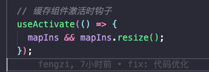

# 地图｜高德地图api使用（持续记录）

## 目录

- [地图｜高德地图api使用（持续记录）](#地图高德地图api使用持续记录)
  - [目录](#目录)
    - [根据覆盖物调整地图范围](#根据覆盖物调整地图范围)
    - [移动端地图部分marker的显示](#移动端地图部分marker的显示)
    - [页面只有两个地图的时候 导致返回缓存地图页面白屏消失，在另外一个页面的时候resize导致地图大小被置0，所以手动在组件被激活的时候执行resize（）恢复大小](#页面只有两个地图的时候-导致返回缓存地图页面白屏消失在另外一个页面的时候resize导致地图大小被置0所以手动在组件被激活的时候执行resize恢复大小)
      - [测距内容自动绘制路线图标 【测距](#测距内容自动绘制路线图标-测距)
    - [没有到高德地图定义的层级 也显示行政区内容](#没有到高德地图定义的层级-也显示行政区内容)
    - [高德地图海量点和marker的区别](#高德地图海量点和marker的区别)
    - [高德地图返回的城市数据与普通直辖市的数据](#高德地图返回的城市数据与普通直辖市的数据)

### 根据覆盖物调整地图范围

<https://lbs.amap.com/demo/javascript-api/example/common/setfitview>

通过设置padding可使覆盖物偏移

- location移动端适配展示，计算底部bottom返回偏移量

### 移动端地图部分marker的显示

<https://blog.csdn.net/chenjing928/article/details/80367320>

目的：减少接口请求的情况，对于地图大容量数据的返回，采用可视区域分页加载的情况展示。

### 页面只有两个地图的时候 导致返回缓存地图页面白屏消失，在另外一个页面的时候resize导致地图大小被置0，所以手动在组件被激活的时候执行resize（）恢复大小

canva画布尺寸发生变化，导致缓存内容丢失。有关系



#### 测距内容自动绘制路线图标 【测距

当传入\_mapIns自动绘制地图路线，可以指设置途经点。

```react&#x20;tsx
    /**
     * @description 调取高德接口获取测距数据
     * @param start 起点经纬度（地址）
     * @param end 终点经纬度（地址）
     * @param mode 测距类型
     * @param Constructor //实例
     * @return 返回测距信息 { mode, distance, time }
     */
  const calculateDistance = (start, end, mode, Constructor) => {
    return new Promise((resolve, reject) => {
      const instance = new Constructor({
        map: _mapIns
      });
      setRoadIns(instance);
      instance.search(start, end, function (status, result) {
        if (status === 'complete') {
          const distance = result.routes[0].distance || 0;
          const time = result.routes[0].time || 0;
          const info = { mode, distance, time };
          resolve(info);
        } else {
          reject(`获取${mode}数据失败：` + result);
        }
      });
    });
  };
  
  
 // example
 // info = await calculateDistance(start, end, '步行', window.AMap.Walking);
  

```

### 没有到高德地图定义的层级 也显示行政区内容

//TODO：

### 高德地图海量点和marker的区别

当需要在地图添加千级以上的点标记时，LabelMarker 是代替 Marker 的更好选择。不同于 MassMarks，LabelMarker 不仅可以绘制图标，还可以为图标添加文字信息，且万级以上数据也具有较好性能，配置也更加灵活。另外，LabelMarker 之间还支持避让功能，JSAPI 2.0 版本还支持地图标注避让 LabelMarker，可以让marker 更加明显。

海量点绘制在地图canvas上面，marker以添加dom的方式加载在页面。当两者混合使用的时候，不可以用index得方式修改marker的层级

### 高德地图返回的城市数据与普通直辖市的数据

1. 高德地图逆地理编码时city返回数组或者空字符串的反序列化的问题
2. 台湾以及外国区域在返回经纬度不能输数组的方式创建信息，回报错【获取不到经纬度信息】，这个使用需要使用高德地图的`new LngLat()`方法创建点击的时候的经纬度信息
