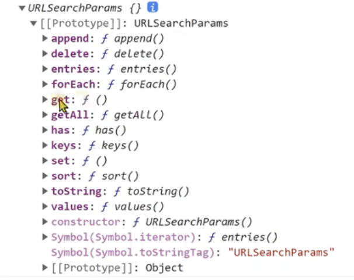

# React Router

## 目录

- [React Router](#react-router)
  - [目录](#目录)
  - [声明式导航](#声明式导航)
    - [1. BrowerRouter](#1-browerrouter)
    - [2. Link](#2-link)
    - [3. Routes](#3-routes)
    - [4. Route](#4-route)
  - [编程式导航](#编程式导航)
    - [携带参数](#携带参数)
      - [useSearchParams](#usesearchparams)
      - [Params传参](#params传参)
  - [嵌套路由（Layout）](#嵌套路由layout)
    - [默认二级路由](#默认二级路由)
  - [404路由配置](#404路由配置)

## 声明式导航

### 1. BrowerRouter

作用: 包裹整个应用，一个React应用只需要使用一次

|              |                             |                                                                                                |
| ------------ | --------------------------- | ---------------------------------------------------------------------------------------------- |
| **模式**       | **实现方式**                    | **路由url表现**                                                                                    |
| HashRouter   | 监听url hash值实现               | [http://localhost:3000/#/about](http://localhost:3000/#/about "http://localhost:3000/#/about") |
| BrowerRouter | h5的 history.pushState API实现 | [http://localhost:3000/about](http://localhost:3000/about "http://localhost:3000/about")       |

### 2. Link

作用: 用于指定导航链接，完成声明式的路由跳转 类似于 \<router-link/>


### 3. Routes

作用: 提供一个路由出口，组件内部会存在多个内置的Route组件，满足条件的路由会被渲染到组件内部

类比 router-view


### 4. Route

作用: 用于定义路由路径和渲染组件的对应关系 \[element：因为react体系内 把组件叫做react element]

```react&#x20;tsx
// 引入必要的内置组件
import { BrowserRouter, Routes, Route, Link } from 'react-router-dom'

// 准备俩个路由组件

const Home = () => <div>this is home</div>
const About = () => <div>this is about</div>

function App() {
  return (
    <div className="App">
      {/* 按照规则配置路由 */}
      
      {/*声明当前要用一个非hash模式的路由*/}
      <BrowserRouter> 
        <Link to="/">首页</Link>
        <Link to="/about">关于</Link>
        
        {/*路由出口 路由对应的组件会在这里渲染*/}
        <Routes>
        {/* 指定路径和组件的对应关系，path代表路径 element代表组件 成对出现 path -> element*/}
          <Route path="/" element={<Home />}></Route>
          <Route path="/about" element={<About />}></Route>
        </Routes>
      </BrowserRouter>
    </div>
  )
}

export default App
```

## 编程式导航

\*\*概念:  \*\*通过js编程的方式进行路由页面跳转，比如说从首页跳转到关于页

**实现步骤：**

1. 导入一个 useNavigate 钩子函数
2. 执行 useNavigate 函数 得到 跳转函数
3. 在事件中执行跳转函数完成路由跳转

```react&#x20;tsx
// 导入useNavigate函数
import { useNavigate } from 'react-router-dom'
const Home = () => {
  // 执行useNavigate得到一个跳转函数
  const navigate = useNavigate()
  return (
    <div>
      Home
      {/* 调用挑战函数且传入目标路径*/}
      <button onClick={ ()=> navigate('/about') }> 跳转关于页 </button>
    </div>
  )
}

export default Home
```

指定跳转方式可以添加一个参数

```react&#x20;tsx
navigate('/about', { replace: true } )
```

### 携带参数

#### useSearchParams

路由穿参

`navigate('/about?id=1000'`

路由取参

```react&#x20;tsx
import {useSearchParams} form 'react-router-dom'

function About(){
  const [params] = useSearchParams()
  {/*
  params 是一个对象，对象中包含一个get方法用来获取对应的参数
  把参数名称作为get方法的实参传过来
  */}
  const id = params.get('id')
  return (
    <div>about:{id}</div>
  )
}


```

parmas对象中有很多方法(useSearchParams())



#### Params传参

动态路由

路由传参

`<Route path="/about/:id" element={<About />}></Route>`

`navigate('/about/10001'`

路由取参

```react&#x20;tsx
let params = useParams()
let id = params.id
```

个数少的时候可以使用

## 嵌套路由（Layout）

实现步骤：

1. App.js中定义嵌套路由声明
2. Layout组件内部通过 \<Outlet/> 指定二级路由出口

1- App.js组件中定义路由嵌套关系

```react&#x20;tsx
<Routes>
  <Route path="/"  element={<Layout/>}>
    <Route path="board" element={ <Board/> } />
    <Route path="article" element={ <Article/> } />
  </Route>
   { /* 省略部分  */ }
</Routes>


```

2- Layout.js组件中使用 Outlet 组件添加二级路由出口

```react&#x20;tsx
import { Outlet } from 'react-router-dom'

const Layout = () => {
  return (
    <div>
      layout
      { /* 二级路由的path等于 一级path + 二级path  */ }
      <Link to="/board">board</Link>
      <Link to="/article">article</Link>
      { /* 二级路由出口 */ }
      <Outlet/>
    </div>
  )
}
export default Layout

```

#### 默认二级路由

场景: 应用首次渲染完毕就需要显示的二级路由

实现步骤:

1. 给默认二级路由标记`index`属性
2. 把原本的路径path属性去掉

```react&#x20;tsx
<Routes>
  <Route path="/"  element={<Layout/>}>
    <Route index element={ <Board/> } />
    <Route path="article" element={ <Article/> } />
  </Route>
</Routes>
```

```react&#x20;tsx
import { Outlet } from 'react-router-dom'

const Layout = () => {
  return (
    <div>
      layout
      { /* 默认二级不再具有自己的路径  */ }
      <Link to="/">board</Link>
      <Link to="/article">article</Link>
      { /* 二级路由出口 */ }
      <Outlet/>
    </div>
  )
}
```

## 404路由配置

默认路由：当url的路径在整个路由配置中都找不到对应的path，使用404兜底组件进行渲染

```react&#x20;tsx
const NotFound = () => {
  return <div>this is NotFound</div>
}

export default NotFound
```

```react&#x20;tsx
<BrowserRouter>
  <Routes>
    <Route path="/" element={<Layout />}>
      <Route index element={<Board />} />
      <Route path="article" element={<Article />} />
    </Route>
    
    {/* 兜底匹配*/}
    <Route path="*" element={<NotFound />}></Route>
  </Routes>
</BrowserRouter>
```
