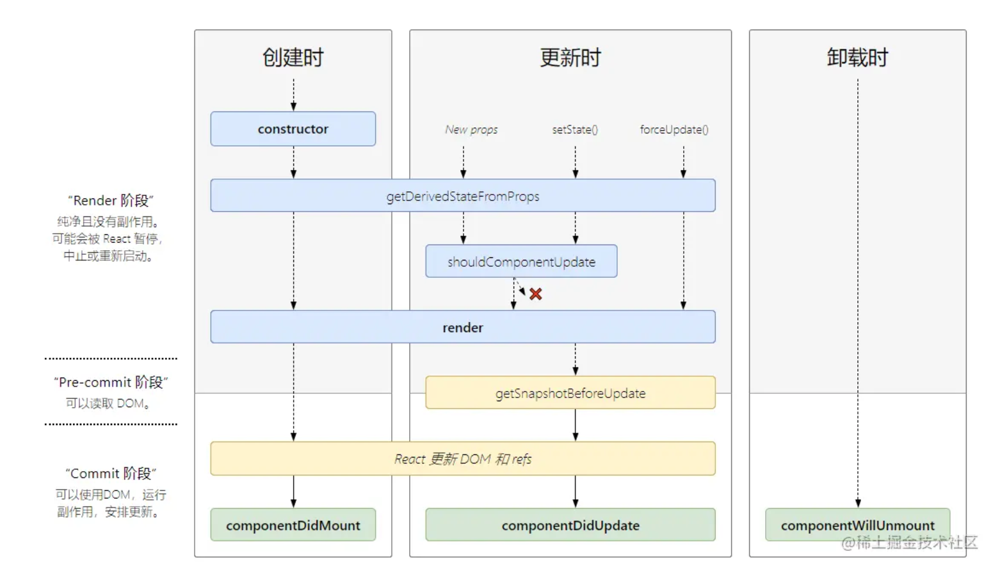

# react生命周期

## 目录

- [react生命周期](#react生命周期)
  - [目录](#目录)
  - [一. 总览](#一-总览)
  - [二. 各大生命周期函数详解](#二-各大生命周期函数详解)
    - [1. constructor()](#1-constructor)
    - [2. static getDerivedStateFromProps(nextProps, state)](#2-static-getderivedstatefrompropsnextprops-state)
    - [3. render()](#3-render)
    - [4. componentDidMount()](#4-componentdidmount)
    - [5. shouldComponentUpdate(nextProps, nextState)](#5-shouldcomponentupdatenextprops-nextstate)
    - [6. getSnapshotBeforeUpdate(prevProps, prevState)](#6-getsnapshotbeforeupdateprevprops-prevstate)
    - [7. componentDidUpdate(prevProps, prevState, snapshot)](#7-componentdidupdateprevprops-prevstate-snapshot)
    - [8. componentWillUnmount()](#8-componentwillunmount)
  - [三. 生命周期执行顺序](#三-生命周期执行顺序)
    - [创建时](#创建时)
    - [更新时](#更新时)
    - [卸载时](#卸载时)
    - [一、父子组件初始化](#一父子组件初始化)
    - [二、子组件修改自身状态 state](#二子组件修改自身状态-state)
    - [三、修改父组件中传入子组件的 props](#三修改父组件中传入子组件的-props)
    - [四、卸载子组件](#四卸载子组件)
    - [五、重新挂载子组件](#五重新挂载子组件)
    - [父子组件生命周期执行顺序总结：](#父子组件生命周期执行顺序总结)

## 一. 总览

- 挂载
  - constructor
  - getDerivedStateFromProps
  - render
  - componentDidMount
- 更新
  - getDerivedStateFromProps
  - shouldComponentUpdate
  - render
  - getSnapshotBeforeUpdate
  - componentDidUpdate
- 卸载
  - componentWillUnmount

## 二. 各大生命周期函数详解

#### 1. constructor()

`constructor()` 在**React组件挂载之前**被调用，在为React.Component子类实现构造函数时，应在其他语句之前调用 `super()`

> super的作用：将父类的this对象继承给子类 ([MDN参考](https://link.juejin.cn/?target=https://developer.mozilla.org/zh-CN/docs/Web/JavaScript/Reference/Operators/super#%E6%8F%8F%E8%BF%B0 "MDN参考"))

通常，React构造函数仅用于以下两种情况：

- **来初始化函数内部 state**
- **为 **[**事件处理函数**](https://link.juejin.cn/?target=https://zh-hans.reactjs.org/docs/handling-events.html "事件处理函数")** 绑定实例**

> 如果不初始化 state 或不进行方法绑定，则不需要写 constructor() , 只需要设置 this.state 即可

> 不能在 constructor()构造函数内部调用 this.setState(), 因为此时第一次 render()还未执行，也就意味DOM节点还未挂载

#### 2. static getDerivedStateFromProps(nextProps, state)

`getDerivedStateFromProps()` 在调用 `render`方法之前调用，在初始化和后续更新都会被调用

> 返回值：返回一个对象来更新 `state`, 如果返回 `null` 则不更新任何内容

> 参数： 第一个参数为即将更新的 `props`, 第二个参数为上一个状态的 `state` , 可以比较`props` 和 `state`来加一些限制条件，防止无用的state更新

> 注意：`getDerivedStateFromProps` 是一个静态函数，不能使用this, 也就是只能作一些无副作用的操作

#### 3. render()

`render()` 方法是class组件中唯一必须实现的方法，用于渲染dom, `render()`方法必须返回reactDOM

> 注意： 不要在 `render` 里面 `setState`, 否则会触发死循环导致内存崩溃

#### 4. componentDidMount()

> componentDidMount() 在组件挂载后 (插入DOM树后) 立即调用，componentDidMount() 是发送网络请求、启用事件监听方法的好时机，并且可以在 此钩子函数里直接调用 setState()

#### 5. shouldComponentUpdate(nextProps, nextState)

`shouldComponentUpdate()` 在组件更新之前调用，可以控制组件是否进行更新， 返回true时组件更新， 返回false则不更新

> 包含两个参数，第一个是即将更新的 props 值，第二个是即将跟新后的 state 值，可以根据更新前后的 props 或 state 来比较加一些限制条件，决定是否更新，进行性能优化

> 不建议在 `shouldComponentUpdate()` 中进行深层比较或使用 `JSON.stringify()`。这样非常影响效率，且会损害性能

> 不要 `shouldComponentUpdate` 中调用 setState()，否则会导致无限循环调用更新、渲染，直至浏览器内存崩溃

> 可以使用内置 [**PureComponent**](https://link.juejin.cn?target=https://zh-hans.reactjs.org/docs/react-api.html#reactpurecomponent "PureComponent") 组件替代
>
> `React.PureComponent` 中的 `shouldComponentUpdate()` 仅作对象的浅层比较。如果对象中包含复杂的数据结构，则有可能因为无法检查深层的差别，产生错误的比对结果。仅在你的 props 和 state 较为简单时，才使用 `React.PureComponent`，或者在深层数据结构发生变化时调用 [forceUpdate()](https://zh-hans.legacy.reactjs.org/docs/react-component.html#forceupdate "forceUpdate()") 来确保组件被正确地更新。你也可以考虑使用 [immutable 对象](https://immutable-js.com/ "immutable 对象")加速嵌套数据的比较。

#### 6. getSnapshotBeforeUpdate(prevProps, prevState)

`getSnapshotBeforeUpdate()` 在最近一次的渲染输出被提交之前调用。也就是说，在 render 之后，即将对组件进行挂载时调用。

> 它可以使组件在 DOM 真正更新之前捕获一些信息（例如滚动位置），此生命周期返回的任何值都会作为参数传递给 `componentDidUpdate()`。如不需要传递任何值，那么请返回 null

> 📌snapshot-快照

#### 7. componentDidUpdate(prevProps, prevState, snapshot)

`componentDidUpdate()` 会在更新后会被立即调用。首次渲染不会执行

> 包含三个参数，第一个是上一次props值。 第二个是上一次state值。如果组件实现了 `getSnapshotBeforeUpdate()` 生命周期（不常用），第三个是“snapshot” 参数传递

> 可以进行前后props的比较进行条件语句的限制，来进行 `setState()` , 否则会导致死循环

#### 8. componentWillUnmount()

`componentWillUnmount()` 在组件即将被卸载或销毁时进行调用。

> 此生命周期是**取消网络请求**、移除**监听事件**、**清理 DOM 元素**、**清理定时器**等操作的好时机

## 三. 生命周期执行顺序

#### 创建时

- constructor()
- static getDerivedStateFromProps()
- render()
- componentDidMount()

#### 更新时

- static getDerivedStateFromProps()
- shouldComponentUpdate()
- render()
- getSnapshotBeforeUpdate()
- componentDidUpdate()

#### 卸载时

- componentWillUnmount()

#### 一、父子组件初始化

父子组件第一次进行渲染加载时：

控制台的打印顺序为：

- Parent 组件： constructor()
- Parent 组件： getDerivedStateFromProps()
- Parent 组件： render()
- Child 组件： constructor()
- Child 组件： getDerivedStateFromProps()
- Child 组件： render()
- Child 组件： componentDidMount()
- Parent 组件： componentDidMount()

#### 二、子组件修改自身状态 state

点击子组件 \[改变自身状态counter] 按钮，其 \[自身状态counter] 值会 +1, 此时控制台的打印顺序为：

- Child 组件： getDerivedStateFromProps()
- Child 组件： shouldComponentUpdate()
- Child 组件： render()
- Child 组件： getSnapshotBeforeUpdate()
- Child 组件： componentDidUpdate()

#### 三、修改父组件中传入子组件的 props

点击父组件中的 \[改变传给子组件的属性 count] 按钮，则界面上 \[父组件传过来的属性 count] 的值会 + 1，控制台的打印顺序为：

- Parent 组件： getDerivedStateFromProps()
- Parent 组件： shouldComponentUpdate()
- Parent 组件： render()
- Child 组件： getDerivedStateFromProps()
- Child 组件： shouldComponentUpdate()
- Child 组件： render()
- Child 组件： getSnapshotBeforeUpdate()
- Parent 组件： getSnapshotBeforeUpdate()
- Child 组件： componentDidUpdate()
- Parent 组件： componentDidUpdate()

#### 四、卸载子组件

点击父组件中的 \[卸载 / 挂载子组件] 按钮，则界面上子组件会消失，控制台的打印顺序为：

- Parent 组件： getDerivedStateFromProps()
- Parent 组件： shouldComponentUpdate()
- Parent 组件： render()
- Parent 组件： getSnapshotBeforeUpdate()
- Child 组件： componentWillUnmount()
- Parent 组件： componentDidUpdate()

#### 五、重新挂载子组件

再次点击父组件中的 \[卸载 / 挂载子组件] 按钮，则界面上子组件会重新渲染出来，控制台的打印顺序为：

- Parent 组件： getDerivedStateFromProps()
- Parent 组件： shouldComponentUpdate()
- Parent 组件： render()
- Child 组件： constructor()
- Child 组件： getDerivedStateFromProps()
- Child 组件： render()
- Parent 组件： getSnapshotBeforeUpdate()
- Child 组件： componentDidMount()
- Parent 组件： componentDidUpdate()

#### 父子组件生命周期执行顺序总结

- 当子组件自身状态改变时，不会对父组件产生副作用的情况下，父组件不会进行更新，即不会触发父组件的生命周期
- 当父组件中状态发生变化（包括子组件的挂载以及卸载）时，会触发自身对应的生命周期以及子组件的更新
  - `render` 以及 `render` 之前的生命周期，则 父组件先执行
  - `render` 以及 `render`之后的声明周期，则子组件先执行，并且是与父组件交替执行
        当子组件进行卸载时，只会执行自身的 `componentWillUnmount` 生命周期，不会再触发别的生命周期
