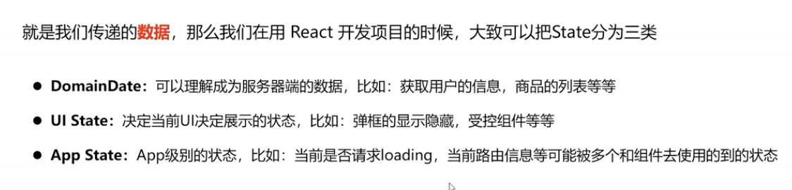
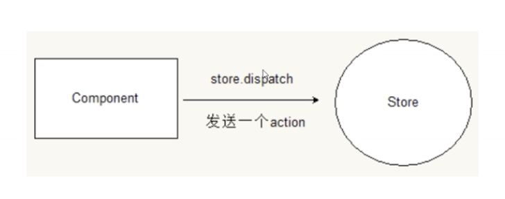
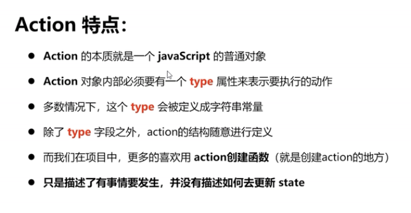
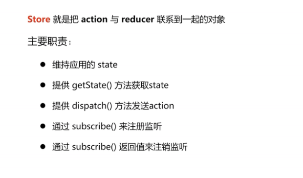
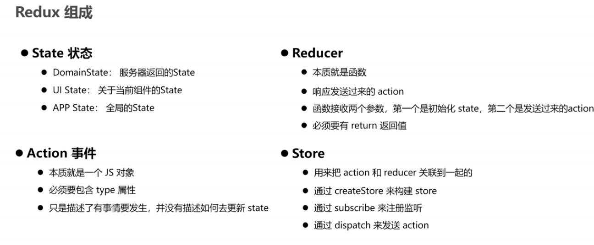

# redux

## 目录

- [redux](#redux)
  - [目录](#目录)
- [Redux介绍](#redux介绍)
  - [Redux数据流架构](#redux数据流架构)
    - [**state-状态**](#state-状态)
    - [**Action-事件**](#action-事件)
    - [reducer](#reducer)
    - [store](#store)
    - [总结](#总结)

# Redux介绍

Redux是React中使用广泛的集中状态管理工具 类比vuex之于vue 同类的工具还有mobx等


## Redux数据流架构

Redux的难点是理解它对于数据修改的规则, 下图动态展示了在整个数据的修改中，数据的流向


为了职责清晰，Redux代码被分为三个核心的概念，我们学redux，其实就是学这三个核心概念之间的配合，三个概念分别是:

1. state: 一个对象 存放着我们管理的数据
2. action: 一个对象 用来描述你想怎么改数据
3. reducer: 一个函数 根据action的描述更新state

redux是一个js容器，用于全局的状态管理

三大核心：

1. 单一数据源头
2. State是只读的
3. 使用纯函数来执行修改

### **state-状态**



### **Action-事件**

Action就是把数据从应用传到store的载体，

他是store数据的唯一来源，通过`store.dispath()` 将action传递给store





```react&#x20;tsx
//action
{
  type: '123'
  info: (...),
  isLoading: true
    ...
}

// action创建函数
function addAction(params)(
  //返回一个action对象
  return {
    type: '123'
    ...params
  }
)
```

### reducer

本质就是一个函数，用来响应发送过来的action，处理后将state发送给store

tips：

**reducer函数中必须有return返回值，这样store才能接收到数据**

函数会接受两个参数，第一个参数是初始化state，第二个参数是action

```react&#x20;tsx
const initState = (...);
rootReducer = ( state = initState, action ) => (...return (...));
```

### store



```react&#x20;tsx
import { createStore } from 'redux'
const store = createStore(传递reducer)
```

### 总结



text

```react&#x20;tsx
  // 定义reducer函数 
  // 内部主要的工作是根据不同的action 返回不同的state

function countReducer (state = {count: 0}, action){
  switch (action.type){
    case 'a':
    return { count: state.count + 1 }
    case 'b':
    return { count: state.count + 1 }
    default:
    return state
  }
}

  // 使用reducer函数生成store实例
import { createStore } from 'redux'
const store = creatStore(countReducer)


  // 订阅数据变化
store.subscribe(()=>{
  console.log(store.getState())
  document.getElementById('count').innerText = store.getState().count
})
  
  
  // 增
const inBtn = document.getElementById('increment')
inBtn.addEventListener('click', () => {
  store.dispatch({
    type: 'a'
  })
})
  // 减
const dBtn = document.getElementById('decrement')
dBtn.addEventListener('click', () => {
  store.dispatch({
    type: 'b'
  })
})
```

toolkit

```react&#x20;tsx
import { createSlice, configureStore } from '@reduxjs/toolkit'

const counterSlice = createSlice({
  name: 'counter',
  initialState: {
    value: 0
  },
  reducers: {
    incremented: state => {
      // Redux Toolkit 允许在 reducers 中编写 "mutating" 逻辑。
      // 它实际上并没有改变 state，因为使用的是 Immer 库，检测到“草稿 state”的变化并产生一个全新的
      // 基于这些更改的不可变的 state。
      state.value += 1
    },
    decremented: state => {
      state.value -= 1
    }
  }
})

export const { incremented, decremented } = counterSlice.actions

const store = configureStore({
  reducer: counterSlice.reducer
})

// 可以订阅 store
store.subscribe(() => console.log(store.getState()))

// 将我们所创建的 action 对象传递给 `dispatch`
store.dispatch(incremented())
// {value: 1}
store.dispatch(incremented())
// {value: 2}
store.dispatch(decremented())
// {value: 1}
```
