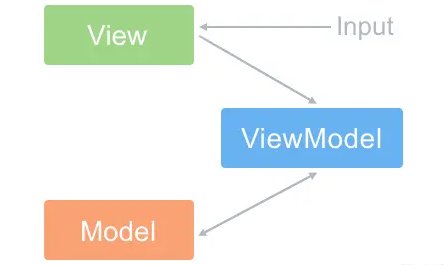
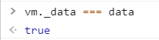
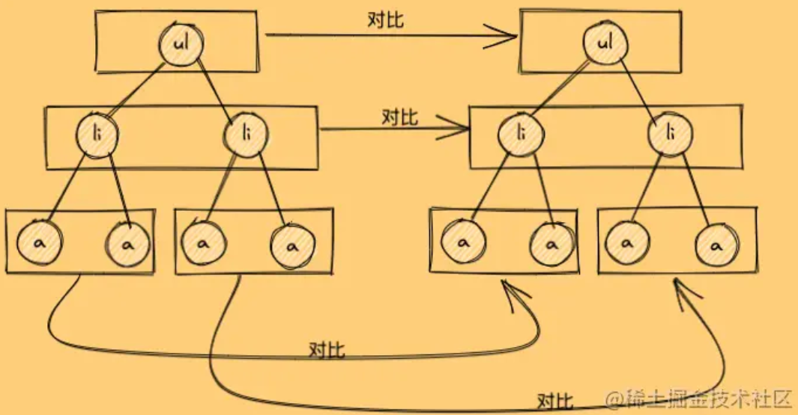
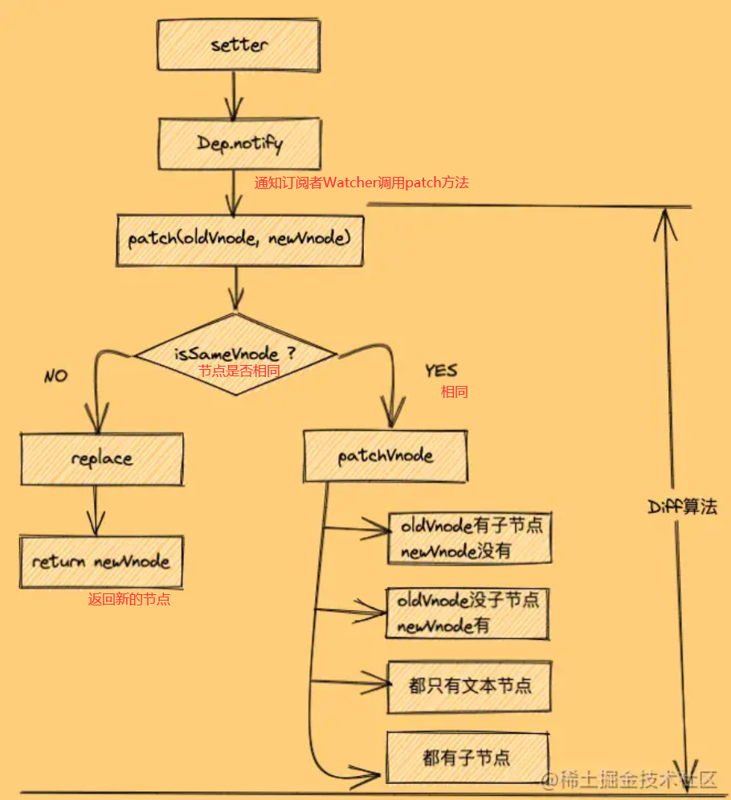

# VUE

##  MVVM模型

Model层代表数据模型（data），View代表UI组件（模板），ViewModel（Vue实例对象）是View和Model层的桥梁，**数据会绑定到viewModel层并自动将数据渲染到页面中，视图变化的时候会通知viewModel层更新数据**。以前是操作DOM结构更新视图，现在是数据驱动视图

- ViewModel 层：做了两件事达到了数据的双向绑定 ：
	- **一是将【模型】转化成【视图】**，即将后端传递的数据转化成所看到的页面。
		- 实现的方式是：数据绑定。
	- **二是将【视图】转化成【模型】**，即将所看到的页面转化成后端的数据。
		- 实现的方式是：DOM 事件监听。
    
	
	
  
  为什么官方要说 Vue 没有完全遵循 MVVM 思想呢？
	- 严格的 MVVM 要求 View 不能和 Model 直接通信，而 Vue 提供了$refs 这个属性，让 Model 可以直接操作 View，违反了这一规定，所以说 Vue 没有完全遵循 MVVM。
	**MVVM的优点：**
	- **低耦合**。视图（View）可以独立于Model变化和修改，一个Model可以绑定到不同的View上，当View变化的时候Model可以不变化，当Model变化的时候View也可以不变；
	- **可重用性**。你可以把一些视图逻辑放在一个Model里面，让很多View重用这段视图逻辑。
	- **独立开发**。开发人员可以专注于业务逻辑和数据的开发(ViewModel)，设计人员可以专注于页面设计。
	- **可测试。**
	

## Vue响应式原理：


### Object.defineProperty()方法:

给一个对象添加属性

```JavaScript
Object.defineProperty(obj, prop, descriptor)

obj：必需。目标对象 
prop：必需。需定义或修改的属性的名字
descriptor：必需。目标属性所拥有的特性

```


直接添加—>不可枚举（不能遍历）

- 属性：
- writable：是否可以被重写，true可以重写，false不能重写，默认为false。  
- enumerable：是否可以被枚举（使用for...in或Object.keys()）。设置为true可以被枚举；设置为false，不能被枚举。默认为false。  
- value：值可以使任意类型的值，默认为undefined  
- configurable：是否可以删除目标属性或是否可以再次修改属性的特性（writable, configurable, enumerable）。设置为true可以被删除或可以重新设置特性；设置为false，不能被可以被删除或不可以重新设置特性。默认为false。
	```JavaScript
	let person = {}; 
	Object.defineProperty(person, 'name', {   
	    writable: true || false,   
	    configurable: true || false,   
	    enumerable: true || false,  
	    value:'gjf' 
	});
	
	```
	
- 存取器：Getter和Setter
	```JavaScript
	let number = 18
	Object.defineProperty(person,'age',{
	  
	  get(){
	    return number
	  },
	  set(value){
	    number = value
	    return number
	  }
	
	})
	```
	
	
	

①_data中vue会为其添加getter和setter方法

②_data=data


### Vue底层实现原理

vue.js是采用**数据劫持结合发布者-订阅者模式**的方式，通过Object.defineProperty()来劫持各个属性的setter和getter，在数据变动时发布消息给订阅者，触发相应的监听回调  
Vue是一个典型的MVVM框架，模型（Model）只是普通的javascript对象，修改它则试图（View）会自动更新。这种设计让状态管理变得非常简单而直观

**Observer（数据监听器）** : Observer的核心是通过Object.defineProprtty()来监听数据的变动，这个函数内部可以定义setter和getter，每当数据发生变化，就会触发setter。这时候Observer就要通知订阅者，订阅者就是Watcher

**Watcher（订阅者）** : Watcher订阅者作为Observer和Compile之间通信的桥梁，主要做的事情是：

1. 在自身实例化时往属性订阅器(dep)里面添加自己
2. 自身必须有一个update()方法
3. 待属性变动dep.notice()通知时，能调用自身的update()方法，并触发Compile中绑定的回调

**Compile（指令解析器）** : Compile主要做的事情是解析模板指令，将模板中变量替换成数据，然后初始化渲染页面视图，并将每个指令对应的节点绑定更新函数，添加鉴定数据的订阅者，一旦数据有变动，收到通知，更新试图


### vue如何监测对象中的数据的改变的

1.加工data

响应式（当修改的值的时候，引起了get和set的调用）

set和get，得到值发生了变化，生成虚拟Dom，然后新旧虚拟dom经行对比，然后重新解析模板



```JavaScript
let data = {
        name:'尚硅谷',
        address:'北京',
      }

//创建一个监视的实例对象，用于监视data中属性的变化
const obs = new Observer(data)    
console.log(obs)  

//准备一个vm实例对象
let vm = {}
vm._data = data = obs

function Observer(obj){
  //汇总对象中所有的属性形成一个数组
  const keys = Object.keys(obj)
  //遍历
  keys.forEach((k)=>{
    //这里的this指obs实例对象，从而达到不会出现死循环的情况
    Object.defineProperty(this,k,{
      get(){
        return obj[k]
      },
      set(val){
        console.log(`${k}被改了，我要去解析模板，生成虚拟DOM.....我要开始忙了`)
        obj[k] = val
      }
    })
  })
}
```


getter和setter都是数据刚开始传入就被加工好的，后续加入的数据是不会进行getter和setter的加工的


当对象中还有对象，**底层是个递归**，Vue，一直寻找，一直有get和set


## 为什么 data 是一个函数

组件中的 data 写成一个函数，数据以函数返回值形式定义，这样每复用一次组件，就会返回一份新的 data，**类似于给每个组件实例创建一个私有的数据空间，让各个组件实例维护各自的数据。****而单纯的写成对象形式，就使得所有组件实例共用了一份 data，就会造成一个变了全都会变的结果**

**一个组件被复用多次的话，也就会创建多个实例**。本质上，这些实例用的都是同一个构造函数。 

如果data是对象的话，对象属于**引用类型**，会影响到所有的实例。所以为了保证组件不同的实例之间data不冲突，data必须是一个函数。

## Vue生命周期

- create阶段：vue实例被创建  
	`beforeCreate`: 创建前，此时data和methods中的数据都还没有初始化  
	`created`： 创建完毕，data中有值，未挂载
- mount阶段： vue实例被挂载到真实DOM节点  
	`beforeMount`：可以发起服务端请求，去数据  
	`mounted`: 此时可以操作DOM
- update阶段：当vue实例里面的data数据变化时，触发组件的重新渲染  
	`beforeUpdate` :更新前  
	`updated`：更新后
- destroy阶段：vue实例被销毁  
	`beforeDestroy`：实例被销毁前，此时可以手动销毁一些方法  
	`destroyed`:销毁后


Vue组件的声明周期：

生命周期（父子组件） 父组件beforeCreate --> 父组件created --> 父组件beforeMount --> **子组件beforeCreate --> 子组件created --> 子组件beforeMount --> 子组件 mounted **--> 父组件mounted -->父组件beforeUpdate -->**子组件beforeDestroy--> 子组件destroyed **--> 父组件updated


## computed 和 watch


### Computed

computed看上去是方法，但是实际上是计算属性，它会根据你所依赖的数据动态显示新的计算结果。**计算结果会被缓存**，computed的值在getter执行后是会缓存的，**只有在它依赖的属性值改变之后，下一次获取computed的值时才会重新调用对应的getter来计算**。

**computed 计算属性** 属性的结果会被缓存，当computed中的函数所依赖的属性没有发生改变的时候，那么调用当前函数的时候结果会从缓存中读取。除非依赖的响应式属性变化时才会重新计算，主要当做属性来使用 computed中的函数必须用return返回最终的结果 computed更高效，优先使用。data 不改变，computed 不更新。


### Watch

**watcher 更像是一个 data 的数据监听回调，当依赖的 data 的数据变化，执行回调**，在方法中会传入 newVal 和 oldVal。可以提供输入值无效，提供中间值特场景。Vue 实例将会在实例化时调用 $watch()，遍历 watch 对象的每一个属性。如**果你需要在某个数据变化时做一些事情，使用watch。**


**使用场景** 

`computed`：当一个属性受多个属性影响的时候使用，例：购物车商品结算功能

 `watch`：当一条数据影响多条数据的时候使用，例：搜索数据


## v-for和v-if

当 v-for 和 v-if 处于同一个节点时，**v-for 的优先级比 v-if 更高**，这意味着 **v-if 将分别重复运行于每个 v-for 循环中**。如果要遍历的数组很大，而真正要展示的数据很少时，这将造成很大的性能浪费


## Key的作用和diff算法

- key的作用是为了在diff算法执行时更快的找到对应的节点，**提高diff速度，更高效的更新虚拟DOM**;
	vue和react都是采用**diff算法来对比新旧虚拟节点，从而更新节点**。在vue的diff函数中，**会根据新节点的key去对比旧节点数组中的key，从而找到相应旧节点。**如果没找到就认为是一个新增节点。**而如果没有key，那么就会采用遍历查找的方式去找到对应的旧节点**。一种一个map映射，另一种是遍历查找。相比而言。map映射的速度更快。
- 为了在数据变化时强制更新组件，以避免**“就地复用”**带来的副作用。
	当 Vue.js 用 `v-for` 更新已渲染过的元素列表时，它默认用“就地复用”策略。**如果数据项的顺序被改变，Vue 将不会移动 DOM 元素来匹配数据项的顺序，而是简单复用此处每个元素**，并且确保它在特定索引下显示已被渲染过的每个元素。重复的key会造成渲染错误。


### diff算法

**Diff算法是一种对比算法**。对比两者是**旧虚拟DOM和新虚拟DOM**，对比出是哪个虚拟节点更改了，找出这个虚拟节点，并**只更新这个虚拟节点所对应的真实节点**，而不用更新其他数据没发生改变的节点，实现精准地更新真实DOM，进而提高效率。（较少的重绘和重排）

#### 算法原理：

- 同层对比
	新旧虚拟DOM对比的时候，Diff算法比较只会在同层级进行, 不会跨层级比较。
	
- 当数据改变时，会触发`setter`，并且通过`Dep.notify`去通知所有`订阅者Watcher`，订阅者们就会调用`patch方法`，给真实DOM打补丁，更新相应的视图
	
	**patch方法：**
		对比当前同层的虚拟节点是否为同一种类型的标签
- 是：继续执行`patchVnode方法`进行深层比对
- 否：没必要比对了，直接整个节点替换成`新虚拟节点`
**sameVnode方法**

判断是否为同一类型节点

```JavaScript
function sameVnode(oldVnode, newVnode) {
  return (
    oldVnode.key === newVnode.key && // key值是否一样
    oldVnode.tagName === newVnode.tagName && // 标签名是否一样
    oldVnode.isComment === newVnode.isComment && // 是否都为注释节点
    isDef(oldVnode.data) === isDef(newVnode.data) && // 是否都定义了data
    sameInputType(oldVnode, newVnode) // 当标签为input时，type必须是否相同
  )
}

```


**patchVnode方法：**

- 找到对应的`真实DOM`，称为`el`
- 判断`newVnode`和`oldVnode`**是否指向同一个对象**，如果是，那么直接`return`
- 如果他们**都有文本节点并且不相等**，那么将**`el`****的文本节点设置为****`newVnode`****的文本节点。**
- 如果`oldVnode`有子节点而`newVnode`没有，则删除`el`的子节点
- 如果`oldVnode`没有子节点而`newVnode`有，则将`newVnode`的子节点真实化之后添加到`el`
- 如果两者**都有子节点**，则执行`updateChildren`函数**比较子节点**，这一步很重要

**updateChildren方法**
新旧虚拟节点的子节点对比（**首尾指针法**）

用index做key
```JavaScript
<ul>
   <li v-for="(item, index) in list" :key="index">{{ item.title }}</li>
</ul>
<button @click="add">增加</button>

list: [
        { title: "a", id: "100" },
        { title: "b", id: "101" },
        { title: "c", id: "102" },
      ]
      
add() {
      this.list.unshift({ title: "林三心", id: "99" });
    }//添加到数组起始位置

```

在进行子节点的 `diff算法` 过程中，会进行 旧首节点和新首节点的`sameNode`对比，这一步命中了逻辑，因为现在`新旧两次首部节点` 的 `key` 都是 `0`了，同理，key为1和2的也是命中了逻辑，导致`相同key的节点`会去进行`patchVnode`更新文本，而原本就有的`c节点`，却因为之前没有key为4的节点，而被当做了新节点，所以很搞笑，使用index做key，最后新增的居然是本来就已有的c节点。所以前三个都进行`patchVnode`更新文本，最后一个进行了`新增`，那就解释了为什么所有li标签都更新了。


## Vue组件通信有哪几种方式
父子组件之间的通信
#### **$props 和$emit**

** **父组件向子组件传递数据是通过 prop 传递的（只读不可被修改，单向数据流）

子组件传递数据给父组件是**通过$emit 触发事件**来做到的（`$emit`绑定一个自定义事件`@shijian='helloshijian`', 当这个语句被执行时, 就会将参数arg传递给父组件,**父组件通过v-on监听并接收参数**。）


#### **$parent,$children** 获取当前组件的父组件和当前组件的子组件

```JavaScript
methods: {
    changeA() {
      // 获取到子组件A
      **this.$children[0].messageA **= 'this is new value'
    }
 }
```


```JavaScript
computed:{
    parentVal(){
      return **this.$parent.msg;**
    }
  }
```


要注意边界情况，如在`#app`上拿`$parent`得到的是`new Vue()`的实例，在这实例上再拿`$parent`得到的是`undefined`，而在最底层的子组件拿`$children`是个空数组。也要注意得到`$parent`和`$children`的值不一样，`$children` 的值是数组，而`$parent`是个对象


#### provide/inject

父组件中通过`provide`来提供变量, 然后再子组件中通过`inject`来注入变量。

```JavaScript
A(B(C))
//A
export default {
    name: "A",
    **provide: {
      for: "demo"
    },**
    components:{
      comB
    }
}
//B
export default {
    name: "B",
    **inject: ['for'],**
    data() {
      return {
        **demo: this.for**
      }
    },
    components: {
      comC
    }
  }
//C
export default {
    name: "C",
    **inject: ['for'],**
    data() {
      return {
        demo: this.for
      }
    }
  }
```


#### **$refs **获取组件实例：

如果在普通的 DOM 元素上使用，引用指向的就是 DOM 元素；如**果用在子组件上，引用就指向组件实例，可以通过实例直接调用组件的方法或访问数据**， 我们看一个`ref` 来访问组件的例子:

```JavaScript
//父组件
<template>
  <component-a **ref="comA"**></component-a>
</template>
<script>
  export default {
    mounted () {
      const comA = **this.$refs.comA;**
      console.log(comA.name);  // Vue.js
      comA.sayHello();  // hello
    }
  }
</script>

//子组件
export default {
  data () {
    return {
      **name: 'Vue.js'**
    }
  },
  methods: {
    sayHello () {
      console.log('hello')
    }
  }
}


```


#### **eventBus** 兄弟组件数据传递 这种情况下可以使用事件总线的方式

**eventBus** 又称为事件总线，在vue中可以使用它来作为沟通桥梁的概念, 就像是**所有组件共用相同的事件中心，可以向该中心注册发送事件或接收事件，** 所以组件都可以通知其他组件。

1. **适用于任意组件间通信**。
2. 在 **Vue.prototype**上创建一个中间量，这个中间量各个组件都可以访问。将某个函数挂载在上面，再在另一个函数中触发，就可以实现组件之间通信
3. **安装全局事件总线：**
	```JavaScript
	new Vue({
	  ......
	  beforeCreate() {
	    **Vue.prototype.$bus = this** //安装全局事件总线，$bus就是当前应用的vm
	  },
	    ......
	}) 
	
	**VueComponent.prototype.__prpto__==Vue.prototype
	//这个内置关系：让组件实例对象（vc）可以访问原型上的属性和方法
	
	
	**
	```
	
	**VueComponent.prototype.__prpto__==Vue.prototype<br />//这个内置关系：让组件实例对象（vc）可以访问原型上的属性和方法<br />**
4. 使用事件总线：
	1. 接收数据：A组件想接收数据，则在A组件中给$bus绑定自定义事件，事件的回调留在A组件自身。
		```JavaScript
		methods(){
		  demo(data){......}
		}
		......
		mounted() {
		  this.$bus.$on('xxxx',this.demo)
		}
		```
		
	2. 提供数据：`this.$bus.$emit('xxxx',数据)`
5. 最好在beforeDestroy钩子中，用$off去解绑当前组件所用到的事件。
6. 接收数据方绑定事件$on，提供数据方触发事件 $emit
#### **vuex** 状态管理
- `state`：用于数据的存储，是store中的唯一数据源
- `getters`：如vue中的计算属性一样，基于state数据的二次包装，常用于数据的筛选和多个数据的相关性计算
- `mutations`：类似函数，**改变state数据的唯一途径，且不能用于处理异步事件**
- `actions`：类似于`mutation`，用于提交`mutation`来改变状态，而不直接变更状态，可以包含任意异步操作
- `modules`：类似于命名空间，用于项目中将各个模块的状态分开定义和操作，便于维护
#### localStorage/sessionStorage
通过`window.localStorage.getItem(key)`获取数据 通过`window.localStorage.setItem(key,value)`存储数据
#### **$attrs与 $listeners**

```JavaScript

```


## 
## nextTick的实现
nextTick是Vue提供的一个全局API,是在下**次DOM更新循环结束之后执行延迟回调**，在修改数据之后使用$nextTick，则可以在回调中获取更新后的DOM；
Vue在更新DOM时是异步执行的。只要侦听到数据变化，Vue将开启1个队列，并缓冲在同一事件循环中发生的所有数据变更。如果同一个watcher被多次触发，只会被推入到队列中-次。这种在缓冲时去除重复数据对于避免不必要的计算和DOM操作是非常重要的。nextTick方法会在队列中加入一个回调函数，确保该函数在前面的dom操作完成后才调用；
比如，我在干什么的时候就会使用nextTick，传一个回调函数进去，在里面执行dom操作即可；

## Vuex
Vuex 是一个专为 Vue 应用程序开发的状态管理模式。每一个 Vuex 应用的核心就是 store（仓库）。
1. Vuex 的状态存储是响应式的；当 Vue 组件从 store 中读取状态的时候，
	若 store 中的状态发生变化，那么相应的组件也会相应地得到高效更新 2. 改变 store 中的状态的唯一途径就是显式地提交 (commit) mutation， 这样使得我们可以方便地跟踪每一个状态的变化 Vuex主要包括以下几个核心模块：
2. State：定义了应用的状态数据
3. Getter：在 store 中定义“getter”（可以认为是 store 的计算属性），就像计算属性一样，getter 的返回值会根据它的依赖被缓存起来， 且只有当它的依赖值发生了改变才会被重新计算 '
4. Mutation：是唯一更改 store 中状态的方法，且必须是同步函数 
5. Action：用于提交 mutation，而不是直接变更状态，可以包含任意异步操作 
6. Module：允许将单一的 Store 拆分为多个 store 且同时保存在单一的状态树中


