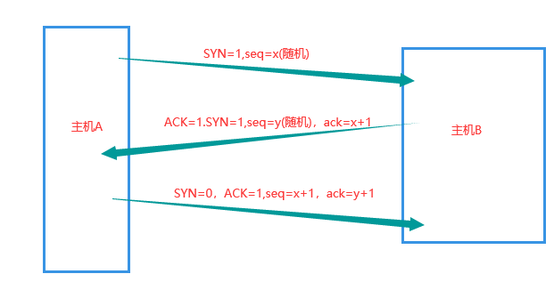
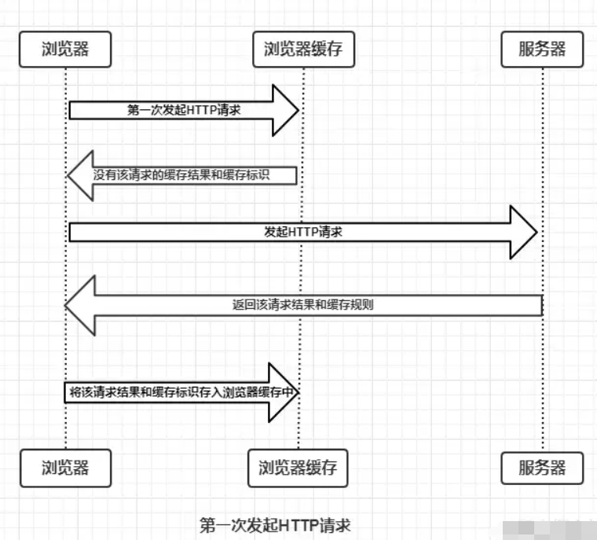
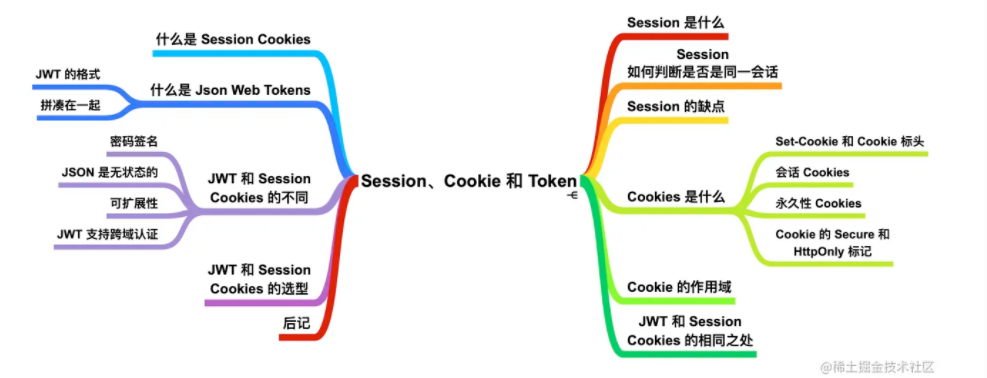
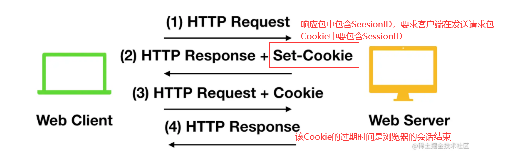
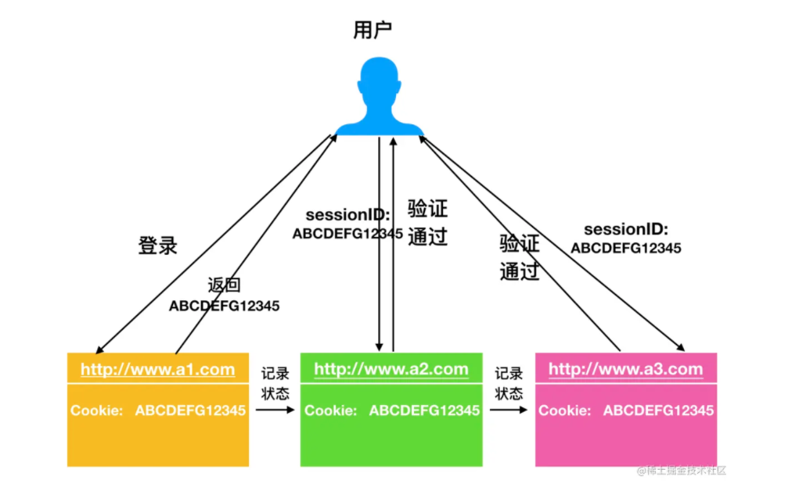

# 浏览器

## 浏览器的工作原理

[https://developer.mozilla.org/zh-CN/docs/Web/Performance/How_browsers_work](https://developer.mozilla.org/zh-CN/docs/Web/Performance/How_browsers_work)

### url解析

网络标准规定了URL只能是字母和数字，还有一些其它特殊符号，比较常见的就是不包括百分号和双引号），而且如果不转义会出现歧义

url编码的规则：utf-8

### DNS查找

[输入www.baidu.com](http://xn--www-0v1en65z.baidu.com) 域名，操作系统会先查hosts件是否有记录，有的话就会把相对应映射的IP返回

hosts文件没有就去查本地dns解析器有没有缓存。

找我们计算机上配置的dns服务器上有或者有缓存，就返回

找根DNS服务器(全球13台，固定ip地址)，然后判断.com域名是哪个服务器管理，如果无法解析，就查找.baidu.com服务器是否能解析，直到查到www.baidu.com的IP地址

### 前端的dns优化，可以在html页面头部写入dns缓存地址

<meta http-equiv="x-dns-prefetch-control" content="on" />

<link rel="dns-prefetch" href="[http://bdimg.share.baidu.com](http://bdimg.share.baidu.com)" />

### 三次握手

第一次握手：主机A发送位码为SYN＝1的TCP包给服务器，并且随机产生一个作为确认号ack（这是tcp包的一部分），主机B收到SYN码后直到A要求建立连接;

第二次握手：主机B收到请求后，向A发送确认号ack（主机A的seq+1），syn=1，seq = 随机数 的TCP包；

第三次握手：主机A收到后检查确认号是否正确，即第一次A发送的确认号ack是否+1了，以及位码ACK是否为1，若正确，主机A会再发送确认号(主机B的seq+1)，ack=1，主机B收到后确认seq值与ack=1则连接建立成功。

#### 为什么两次握手不行

第二次握手，主机B还不能确认主机A已经收到确认请求，也是说B认为建立好连接，开始发数据了，结果发出去的包一直A都没收到，那攻击B就很容易了，我专门发包不接收，服务器很容易就挂了。（SYN洪泛攻击）

### TLS协商（HTTPS协议上建立安全连接）

客户端先向服务器端索要公钥，然后用公钥加密信息，服务器收到密文后，用自己的私钥解密。

### 请求HTML

浏览器就代表用户发送一个初始的HTTP GET请求，对于网站来说，这个请求通常是一个HTML文件。如果存在在浏览器缓存中就直接拿，如果不存在就向后台拿。 一旦服务器收到请求，它将使用相关的响应头和HTML的内容进行回复。

### 解析HTML

1. 构建DOM树(DOM tree)：从上到下解析HTML文档生成DOM节点树（DOM tree），也叫内容树（content tree）；
2. 构建CSSOM(CSS Object Model)树：加载解析样式生成CSSOM树；
3. 执行JavaScript：加载并执行JavaScript代码（包括内联代码或外联JavaScript文件）；
4. 构建渲染树(render tree)：根据DOM树和CSSOM树,生成渲染树(render tree)；
5. 渲染树：按顺序展示在屏幕上的一系列矩形，这些矩形带有字体，颜色和尺寸等视觉属性。
6. 布局（layout）：根据渲染树将节点树的每一个节点布局在屏幕上的正确位置；
7. 绘制（painting）：遍历渲染树绘制所有节点，为每一个节点适用对应的样式，这一过程是通过UI后端模块完成；

## 页面渲染优化

1. HTML文档结构层次尽量少，最好不深于六层；
2. 脚本尽量后放，放在前即可；
3. 少量首屏样式内联放在标签内；
4. 样式结构层次尽量简单；
5. 在脚本中尽量减少DOM操作，尽量缓存访问DOM的样式信息，避免过度触发回流；
6. 减少通过JavaScript代码修改元素样式，尽量使用修改class名方式操作样式或动画；
7. 动画尽量使用在绝对定位或固定定位的元素上；
8. 隐藏在屏幕外，或在页面滚动时，尽量停止动画；
9. 尽量缓存DOM查找，查找器尽量简洁；
10. 涉及多域名的网站，可以开启域名预解析

## DOM和BOM对象

`BOM（Browser Object Model）`是指**浏览器对象模型**，可以对浏览器窗口进行访问和操作。使用 BOM，开发者可以移动窗口、改变状态栏中的文本以及执行其他与页面内容不直接相关的动作。 使 `JavaScript` 有能力与浏览器"对话"。
`DOM （Document Object Model）`是指**文档对象模型**，通过它，可以访问`HTML`文档的所有元素。 `DOM` 是 `W3C`（万维网联盟）的标准。`DOM` 定义了访问 `HTML` 和 `XML` 文档的标准： "W3C 文档对象模型（DOM）是中立于平台和语言的接口，它允许程序和脚本动态地访问和更新文档的内容、结构和样式。" `W3C DOM` 标准被分为 3 个不同的部分：

- 核心 `DOM` - 针对任何结构化文档的标准模型
- `XML DOM` - 针对 XML 文档的标准模型
- `HTML DOM` - 针对 HTML 文档的标准模型

## 变量提升

定义：变量提升是当栈内存作用域形成时，JS代码执行前，浏览器会将带有`var, function`关键字的变量**提前**进行声明 declare(**值默认就是 undefined)**，定义 defined(就是赋值操作)，这种预先处理的机制就叫做变量提升机制也叫预定义。

在变量提升阶段：带 `var` 的只声明还没有被定义，带 `function` 的已经声明和定义。所以在代码执行前有带 `var` 的就提前声明，比如这里的 `a` 就赋值成 `undefined`，在代码执行过程中遇到`创建函数的代码`浏览器会直接跳过。

## 浏览器的缓存机制

浏览器与服务器通信的方式为应答模式，即是：浏览器发起HTTP请求 – 服务器响应该请求。那么浏览器第一次向服务器发起该请求后拿到请求结果，会根据响应报文中HTTP头的缓存标识，决定是否缓存结果，是则将请求结果和缓存标识存入浏览器缓存中

- 浏览器每次发起请求，都会**先在浏览器缓存中查找该请求的结果以及缓存标识**
- 浏览器每次拿到返回的请求结果都会**将该结果和缓存标识存入浏览器缓存中**
- 强缓存：
 **强制缓存就是向浏览器缓存查找该请求结果**，**并根据该结果的缓存规则来决定是否使用该缓存结果的过程。**
- 当浏览器向服务器发起请求时，服务器会将缓存规则放入HTTP响应报文的HTTP头中和请求结果一起返回给浏览器，控制强制缓存的字段分别是 `Expires` 和 `Cache-Control`，其中Cache-Control优先级比Expires高。
 强制缓存的情况主要有三种(暂不分析协商缓存过程)，如下：

 1. 不存在该缓存结果和缓存标识，强制缓存失效，则直接向服务器发起请求（跟第一次发起请求一致）。
 2. 存在该缓存结果和缓存标识，但该结果已失效，强制缓存失效，则使用协商缓存。
 3. 存在该缓存结果和缓存标识，且该结果尚未失效，强制缓存生效，直接返回该结果

- **协商缓存**
 **协商缓存就是强制缓存失效后，浏览器携带缓存标识向服务器发起请求，由服务器根据缓存标识决定是否使用缓存的过程**，同样，协商缓存的标识也是在响应报文的HTTP头中和请求结果一起返回给浏览器的，控制协商缓存的字段分别有：`Last-Modified / If-Modified-Since` 和 `Etag / If-None-Match`，其中Etag / If-None-Match的优先级比Last-Modified / If-Modified-Since高。协商缓存主要有以下两种情况：

 1. 协商缓存生效，返回304
 2. 协商缓存失效，返回200和请求结果结果

## Cookie LocalStorage SessionStroage

**HTTP 协议是一种无状态协议**，即每次服务端接收到客户端的请求时，都是一个**全新的请求**，服务器并不知道客户端的历史请求记录；**Session 和 Cookie 的主要目的就是为了弥补 HTTP 的无状态特性**

**接下来客户端每次向同一个网站发送请求时，请求头都会带上该 Cookie信息（包含 sessionId ）**， 然后，服务器通过读取请求头中的 Cookie 信息，获取名称为 JSESSIONID 的值，得到此次请求的 sessionId。

#### Cookies

HTTP 协议中的 Cookie 包括 `Web Cookie` 和`浏览器 Cookie`，它是服务器发送到 Web 浏览器的一小块数据。服务器发送到浏览器的 Cookie，浏览器会进行存储，并**与下一个请求一起发送到服务器**。通常，**它用于判断两个请求是否来自于同一个浏览器，例如用户保持登录状态。**

**Cookie 主要用于下面三个目的**

- `会话管理`
 登陆、购物车、游戏得分或者服务器应该记住的其他内容
- `个性化`
 用户偏好、主题或者其他设置
- `追踪`
 记录和分析用户行为

`Set-Cookie` HTTP 响应标头将 cookie 从服务器发送到用户代理

[https://juejin.cn/post/6844904115080790023](https://juejin.cn/post/6844904115080790023)

#### 会话 Cookies

上面的示例创建的是会话 Cookie ，会话 Cookie 有个特征，客户端关闭时 Cookie 会删除，因为它没有指定`Expires`或 `Max-Age` 指令。

但是，Web 浏览器可能会使用会话还原，这会使大多数会话 Cookie 保持永久状态，就像从未关闭过浏览器一样。

#### 永久性 Cookies

永久性 Cookie 不会在客户端关闭时过期，而是在`特定日期（Expires）`或`特定时间长度（Max-Age）`外过期。例如

### Cookie 的作用域

`Domain` 和 `Path` 标识定义了 Cookie 的作用域：即 Cookie 应该发送给哪些 URL。

`Domain` 标识指定了哪些主机可以接受 Cookie。如果不指定，默认为当前主机(**不包含子域名**）。如果指定了`Domain`，则一般包含子域名。

例如，如果设置 `Domain=mozilla.org`，则 Cookie 也包含在子域名中（如`developer.mozilla.org`）。

例如，设置 `Path=/docs`，则以下地址都会匹配：

- `/docs`
- `/docs/Web/`
- `/docs/Web/HTTP`

#### Token和Cookies Session

它们既可以对用户进行身份验证，也可以用来在用户单击进入不同页面时以及登陆网站或应用程序后进行身份验证。

都是用来**用来处理在不同页面之间切换，保存用户登录信息的机制**。

Session Cookies 也称为`会话 Cookies`，在 Session Cookies 中，用户的登录状态会保存在`服务器`的`内存`中。当用户登录时，Session 就被服务端安全的创建。

在每次请求时，服务器都会从会话 Cookie 中读取 SessionId，如果服务端的数据和读取的 SessionId 相同，那么服务器就会发送响应给浏览器，允许用户登录。

JWT 中存储的信息是经过**数字签名**的，因此可以被信任和理解。

- **认证(Authorization)：**这是使用 JWT 最常见的一种情况，一旦用户登录，后面每个请求都会包含 JWT，**从而允许用户访问该令牌所允许的路由、服务和资源。**`单点登录`是当今广泛使用 JWT 的一项功能，因为它的开销很小。
- **信息交换(Information Exchange)**：JWT 是能够安全传输信息的一种方式。通过使用公钥/私钥对 JWT 进行签名认证。此外，由于签名是使用 `head` 和 `payload` 计算的，因此你还可以验证内容是否遭到篡改。

### Token 和 Session 的区别

- Session 是一种**记录服务器和客户端会话状态的机制，使服务端有状态化，可以记录会话信息**。而 Token 是**令牌**，**访问资源接口（API）时所需要的资源凭证**。Token **使服务端无状态化，不会存储会话信息。**
- token在客户端一般存放于localStorage，cookie，或sessionStorage中。在服务器一般存于数据库中
- 在post请求的瞬间，cookie会被浏览器自动添加到请求头中。但token不同，token是开发者为了防范csrf而特别设计的令牌，浏览器不会自动添加到headers里，攻击者也无法访问用户的token，所以提交的表单无法通过服务器过滤，也就无法形成攻击。

- session存储于服务器，可以理解为一个状态列表，拥有一个唯一识别符号sessionId，通常存放于cookie中。服务器收到cookie后解析出sessionId，再去session列表中查找，才能找到相应session。依赖cookie
- cookie类似一个令牌，装有sessionId，存储在客户端，**浏览器通常会自动添加。**
- token也类似一个令牌，无状态，用户信息都被加密到token中，服务器收到token后解密就可知道是哪个用户。**需要开发者手动添加。**
- jwt只是一个跨域认证的方案
