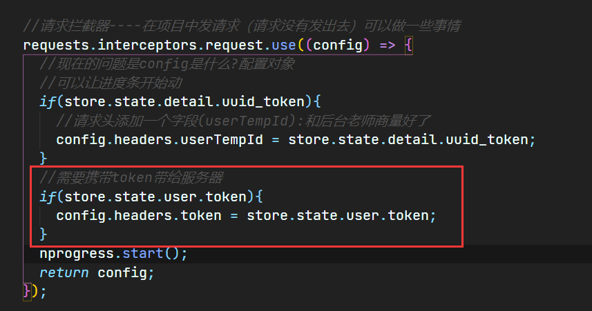
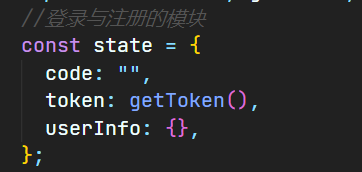
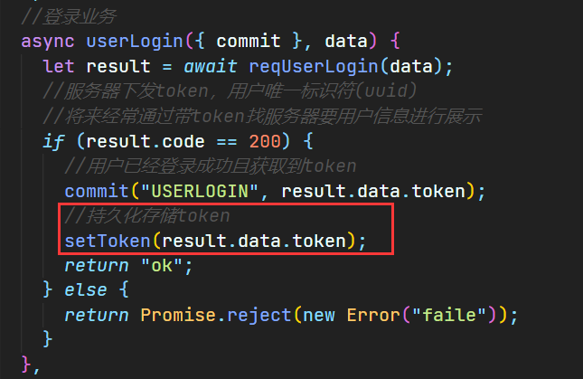
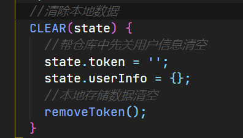
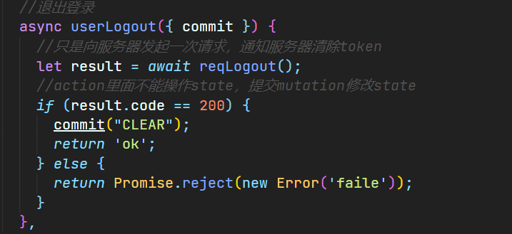
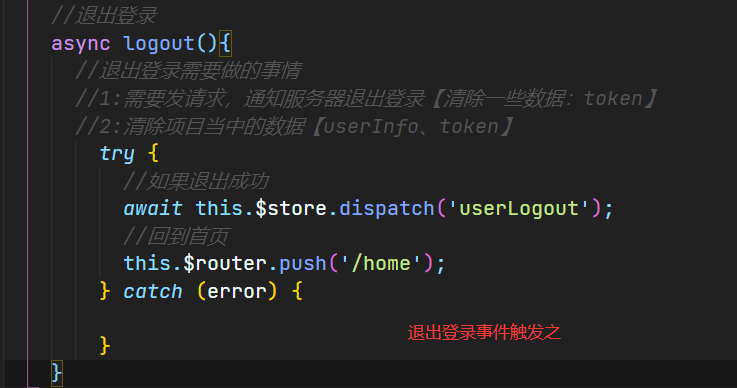
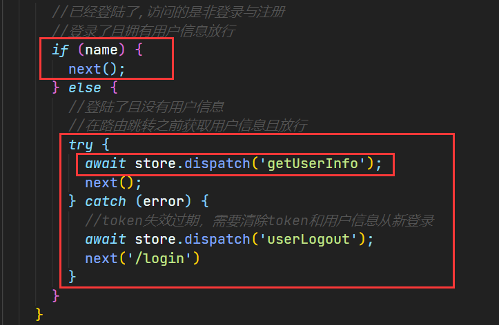
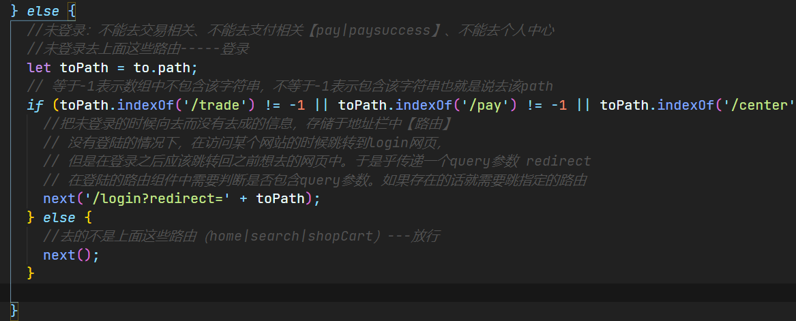
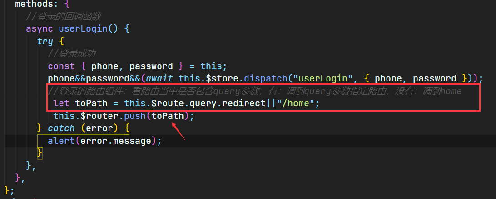
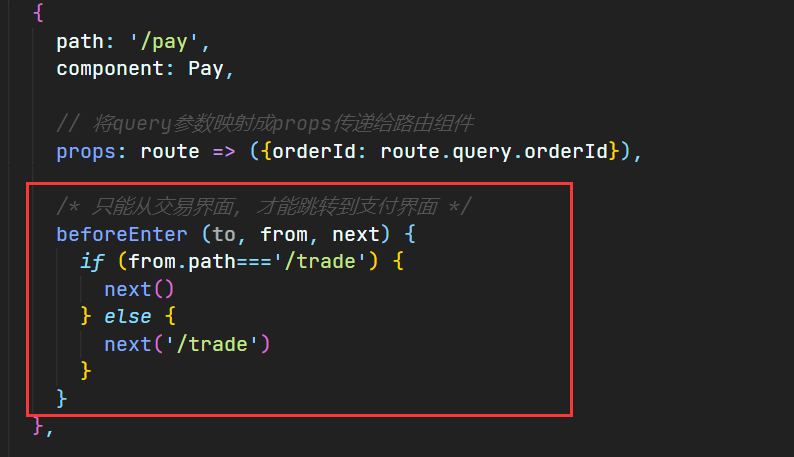

# 项目

## Echarts与D3.js

D3是一种偏函数式编程的方式 基于Svg

echarts是封装好的，所以我们使用起来很方便，只用填写他的配置项就可以使用，但也恰恰因为它被封装好的缘故，所以灵活性较差，我们只能修改它所存在的配置项，如果想要自己添加或修改配置项中不存在的东西是不可以的

我觉得他们之间最大的不同之处就在于echarts它是使用canvas来绘制图形的，而D3是通过Svg来绘制图形的。这两者的不同之处在于，svg可以操作dom支持事件处理器，想要实现某个操作，直接调用相关的方法实现效果就行，他那个里面存在链式语法，这个和jQuery的链式调用差不多，简单易读。canvas不支持事件处理器所以只能展示数据，而不能修改。

D3支持事件处理器可以操作dom，所以如果在项目开发中如果有较多用户交互的场景，可以使用D3.如果项目中一般没有用户交互的场景，我们只需要将图表展示给用户看，而不需要更改，可以使用echarts。因为D3它展示的每一个数据都是一个标签，所以当数据发生改变的时候图表会重新渲染，会不停的操作dom，这对性能的消耗是非常大的。

为何要对数据量大的列表页进行滚动加载优化呢？主要的一个原因就是页面上元素太多了，滚动的时候会有卡顿的问题，移动端上更为明显。

那既然元素太多导致的问题，解决方法不就很明显了吗？没错，就是 **减少页面元素**

这里有一个前提，就是**列表的每个item的高度要一致**，这主要是为了方便计算。

## 登录注册业务

服务器下发token，Vuex存储数据不是持续化的，刷新后就没有了。

登陆成功跳转到首页。展示用户名和信息 —>获取用户名信息（在home组件挂载的时候进行发送请求，并且需要携带上token。在请求拦截器中的请求头中添加一个字段token字段），因为像服务器发送请求的时候是要携带上token的。

显示注册。注册中会存储你的用户名和密码，然后跳转到登陆页面。

用户登录（用户名和密码）向服务器发送请求（组件派发action：userLogin）登录成功获取到token。

home组件挂载的时候就会去像服务器请求用户信息。这个时候就需要在请求拦截器中判断是否有token的存在，同时将token添加在请求头中（存在用户）

本地持久化存储token(在服务器返回token的时候) **`localStorage.setItem('Token',result.data.token)`**

封装一个模块，对外暴露模块内的函数（utils）。在需要的地方调用

Vuex的state中的token：`**token:locakStorage.getItem('token')**`

在未登录的时候，由于本地存储中没有token，所以token字符串为null。

在请求之后服务器下发token，token经过mutations存储到state的token中。token有了值

下一次请求的时候，就直接获取localStorage中的token。

退出登录：

发请求告诉服务器，退出登录。—>清除一些数据 仓库中的token，本地中的token，仓库中的userInFo

退出登录之后也需要将页面跳转到首页中。

> 问题1:多个组件中用户信息需要在每个组件的mounted中触发action：getUserLogin

home组件一刷新就会重新挂载从而派发action获取用户信息

但是其他组件不会这样（总不能在每个路由组件中都去请求），所以将这个判断做到全局路由之中，通过判断是否存在name或者用户信息去判断是否需要派发action

> 问题2:用户登录之后不能再次登录（不能再次回到登录页）

添加全局路由前置前置守卫：在VueRouter中。（在路由跳转的时候进行判断）

判断是否存在token（先从仓库中取得token。）**`let token  = store.state.user.token;`**

如果存在token的话`**if(token){...}**`在跳转到不能去的网页的时候就经行拦截—>`**next('/')**`

如果去的时候不是login或者rejister网页

未登录的情况下，需要对要去页面的的路由进行一个判断。（未登陆的用户无法访问个人中心.....）

路由独享守卫（比如说支付页面必须是从购物车页面跳转过来的）—>配置在router中的

next(false)：中断当前的导航，如果浏览器的地址URL发生改变（可能是用户手动或者浏览器后退），那么URL地址回重置到from路由对应的地址

封装过的组件：

分页器；日历；

图片懒加载（vue-lazyload）
